# Sam's Second Superpower
## Adventures with Sam and Robo -- Book 2
### Everlight Kids | Everlight Ventures

---

**Document Status:** PRODUCTION DRAFT v2.0
**Date:** March 2, 2026
**Format:** 5 Chapters | Interactive Moments | Q&A | Coloring Book Hybrid
**Page Layout:** Left page = B&W coloring illustration | Right page = Full color illustration
**Phonics Focus:** Compound words (backpack, sunset, sunflower, sandbox, rainbow, raincoat, lunchbox, starfish) + sight words (come, here, look, said, they, what)
**Core Value:** Curiosity, scientific thinking, healthy habits, helping friends, patience
**CASEL Competencies:** Self-Management, Responsible Decision-Making, Relationship Skills
**CCSS Alignment:** RL.K.1, RL.K.2, RL.K.3, RL.1.2, RF.K.3, RF.1.3
**Superpower Unlocked:** The ability to perform scientific tasks
**Target Age:** 3-8 (readers 5-7 / listeners 3-5)
**Series Position:** Book 2 of 5 | Builds on Superpower 1 (understanding animals)

---

## SERIES RECAP (inside front cover)

**Sam's Superpowers So Far:**

In Book 1, Sam found a magical book under an old oak tree -- and out popped Robo, his robot best friend! Together they rescued a cat from a tree, fed a hungry rabbit, comforted a sad puppy, calmed an angry bird, and helped a farmer pick apples. Along the way, Sam learned the sounds *at, an,* and *it,* and discovered that curiosity, kindness, and hard work are the real foundation of every superpower.

Sam earned his first superpower: **the ability to understand and communicate with animals.**

Now, in Book 2, Sam and Robo have been invited to a very special place -- a science lab! What will they discover? What will they build? And what new superpower is waiting for Sam?

There's only one way to find out...

---

## CHAPTER 1: Visiting the Science Lab

---

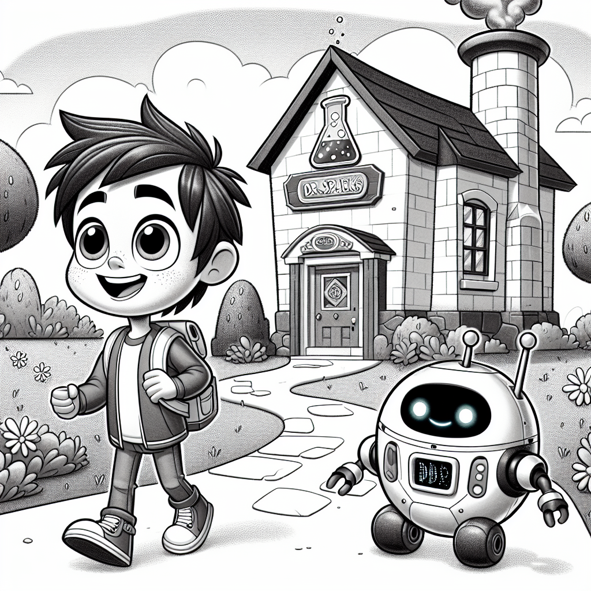

---

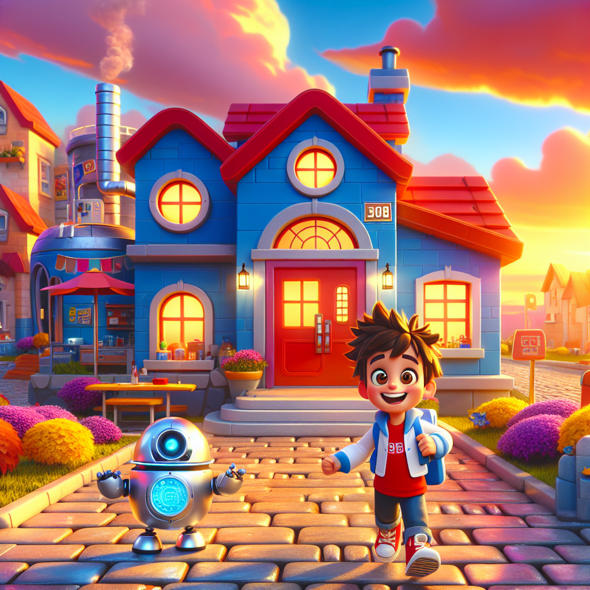

---

Sam and Robo were thrilled to receive an invitation to visit the local science lab.

"A SCIENCE lab!" Sam exclaimed, pulling the letter from his *backpack.* "This is going to be amazing!"

Sam eagerly put on his backpack, ready for the adventure. As they walked to the lab, they admired the beautiful *sunset* painting the sky in orange and pink hues.

"Look at that *sunset,*" said Sam.

Robo's display lit up. "Sam -- *backpack* and *sunset.* Did you notice something about those words?"

Sam said them slowly. "Back... pack. Sun... set."

"Each one is made of two smaller words put together!" said Robo. "Back + pack = *backpack.* Sun + set = *sunset.* These are called **compound words.**"

"Two words that become one!" said Sam. "That's cool. Like... a word *team-up!*"

"Exactly," said Robo. "And we're going to find many more today."

At the lab, Dr. Spark welcomed them with a big smile. He was a tall man with wild silver hair, safety goggles pushed up on his forehead, and a white lab coat covered in colorful stains from experiments past.

"Welcome, Sam and Robo! Today, we'll explore science and learn about compound words."

Sam looked around the lab, amazed by all the cool equipment and gadgets -- beakers, test tubes, magnifying glasses, charts on the walls, and a poster that read: **"QUESTION EVERYTHING. THEN TEST YOUR ANSWER."**

"This place is awesome!" he exclaimed.

Dr. Spark showed them a poster with pictures and words. "A compound word is made up of two smaller words. For example, 'back' and 'pack' make '*backpack.*' 'Sun' and 'set' make '*sunset.*'"

Sam repeated, "*Backpack* and *sunset!* I understand!"

"Great! Let's start our science adventure," Dr. Spark said enthusiastically.

With excitement, they began exploring the lab, touching and examining all the fascinating tools and machines. Robo's eyes lit up with curiosity, beeping in delight at each new discovery. His display showed a magnifying glass scanning each new item.

"Dr. Spark," said Sam, "my grandma says curiosity is the beginning of everything good."

Dr. Spark nodded seriously. "Your grandmother is absolutely right. Every great discovery in history started with someone asking: *'What if?'*"

---

**Interactive Moment:** Can you find the compound words? Put two words together! Sun + flower = ? Rain + coat = ? Lunch + box = ? How many compound words can you make?

**Question:** What two smaller words make up the compound word "backpack"?
**Answer:** "Back" and "pack" -- two small words that team up to make one bigger word!

---

## CHAPTER 2: The First Experiment

---

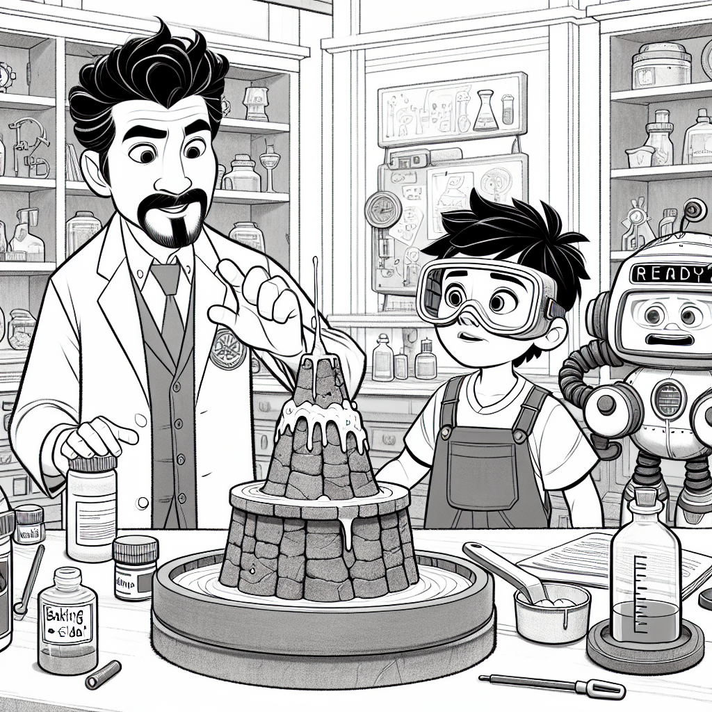

---

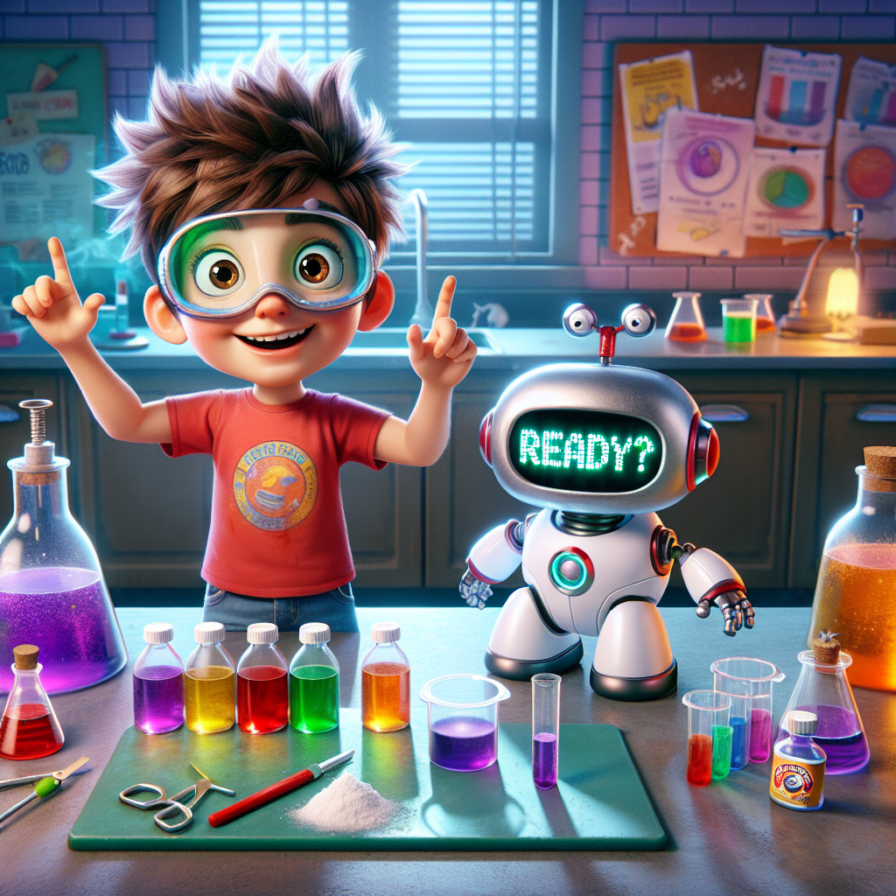

---

Dr. Spark led Sam and Robo to a big table filled with jars and bottles.

"Today, we're making a baking soda volcano!" he announced.

Sam's eyes widened with excitement. "A VOLCANO?!"

"A safe, small, indoor volcano," Dr. Spark said with a wink. "Science is about exploring the world around us -- but always safely. First rule of any lab: *safety first.* Put these on."

He handed Sam a pair of safety goggles. They were a little too big, but Sam wore them proudly.

"Come *here,* Sam, and *look* at this experiment," Dr. Spark said, pointing to the setup.

Sam and Robo stepped closer, eager to learn.

"First," said Dr. Spark, "we put some baking soda into the volcano model. Can you measure two spoonfuls, Sam?"

Sam carefully measured the baking soda, keeping his hand steady. "One... two. Got it!"

"Now, we add vinegar," Dr. Spark explained. He poured the vinegar slowly, and the mixture started to bubble and fizz, creating a mini eruption! Foam rose up and spilled over the sides of the volcano like lava.

"Wow, that's *amazing!*" Sam exclaimed. Robo beeped in agreement, his display showing fireworks.

---

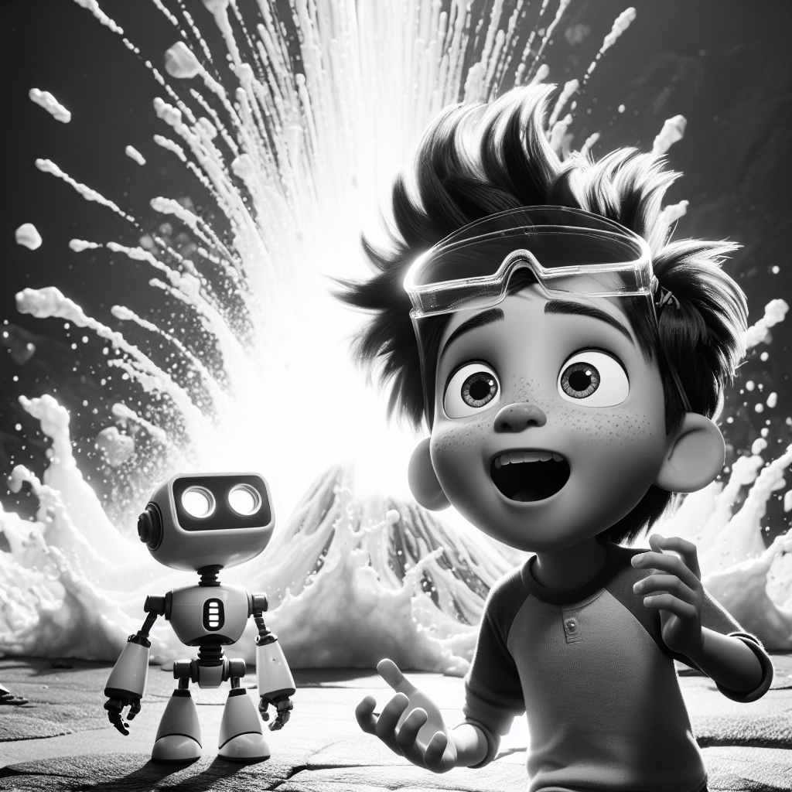

---

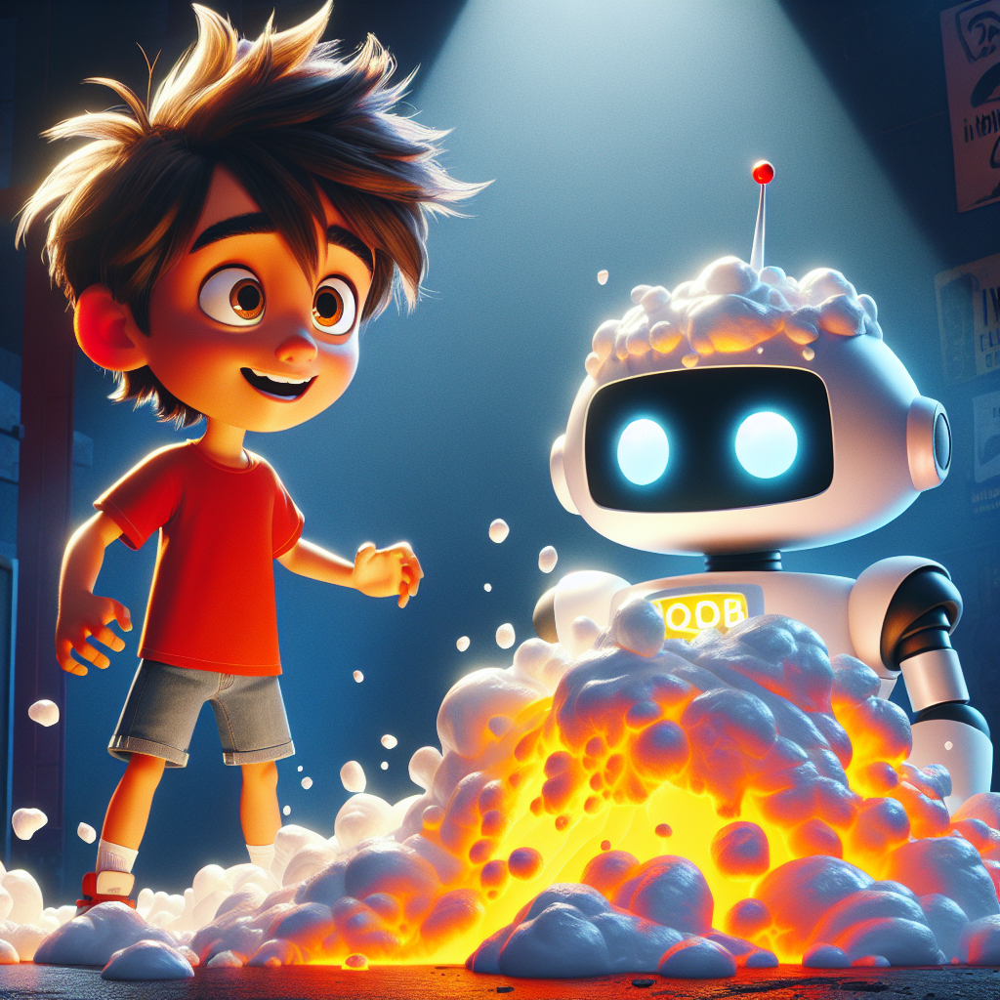

---

"But WHY does it do that?" Sam asked. He leaned closer, studying the bubbles.

Dr. Spark beamed. "THAT is the right question, Sam. When baking soda and vinegar mix, they create a chemical reaction. The baking soda is a *base,* and the vinegar is an *acid.* When they meet, they make carbon dioxide gas -- that's what causes all those bubbles!"

"So the bubbles are a GAS?" said Sam. "Like the air we breathe?"

"Different kind of gas, but yes! Carbon dioxide is what you breathe OUT. And when it gets trapped in the liquid, it makes bubbles, and those bubbles push the foam up and out -- like a volcano!"

"Science is like magic," said Sam, "except you can *explain* it."

Dr. Spark laughed. "That might be the best definition of science I've ever heard."

"Remember the words 'come', 'here', and 'look'," Dr. Spark added. "Can you use them in a sentence, Sam?"

Sam thought for a moment. "Robo, *come here* and *look* at our volcano!"

"Perfect!" said Dr. Spark. They spent the rest of the afternoon conducting experiments and learning new things, their laughter echoing through the lab as they marveled at each new discovery.

Robo processed everything. "Sam, compound word check: what two words make up *lunchbox?*"

"Lunch and box!" said Sam. "Easy!"

"What about *rainbow?*"

"Rain and bow!" Sam grinned. "I'm getting good at this!"

---

**Interactive Moment:** Sam and Robo made a volcano! Can you pretend your hands are a volcano? Start with your fingers together (the baking soda), then open them WIDE with a big "WHOOOOSH!" (the eruption!). What other science experiments would you like to try?

**Question:** What happens when vinegar is added to baking soda in the volcano experiment?
**Answer:** It creates a chemical reaction! The baking soda (a base) and vinegar (an acid) mix together to make carbon dioxide gas, which creates bubbles and makes the foam erupt like a volcano.

---

## CHAPTER 3: Healthy Habits for Scientists

---

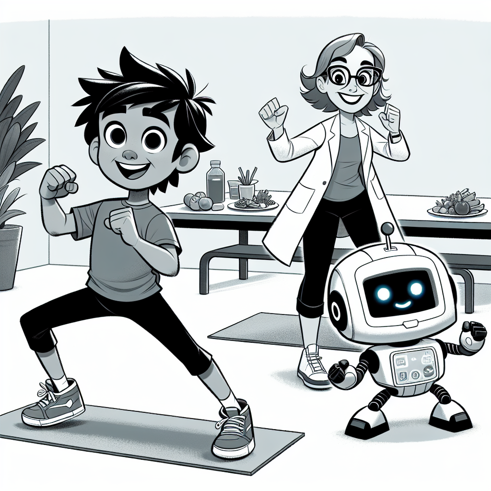

---

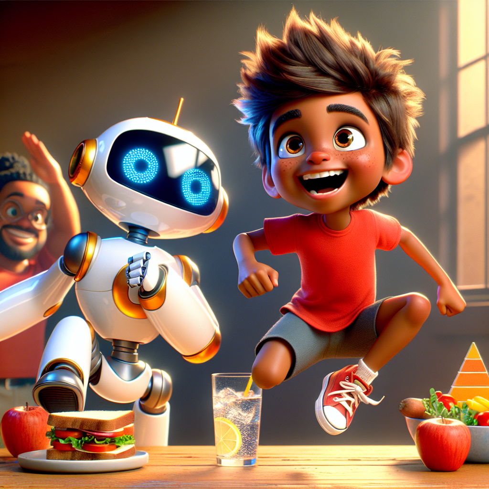

---

After the experiments, Dr. Spark gathered Sam and Robo.

"Now, let's talk about healthy habits," he said. "Because a great scientist needs a healthy body AND a healthy mind."

Sam and Robo listened closely.

"Exercise is very important," Dr. Spark continued. "It keeps your body strong, your mind sharp, and your mood bright. Let's do some fun activities!"

They started with jumping jacks. Sam jumped high, counting each one. "One! Two! Three! Four!"

Robo tried to follow along. His robot arms went up -- but his legs didn't quite cooperate. He looked like a cheerful, confused windmill.

Sam laughed. "Nice try, Robo!"

"I am... still calibrating," Robo said, his display showing a dizzy face.

Then they moved to stretching exercises. Sam touched his toes. Dr. Spark showed him how to stretch his arms overhead and reach for the sky.

"Why does stretching feel so good?" Sam asked.

"Because your muscles need to move and flex," said Dr. Spark. "Think of it like this: a rubber band that never stretches gets stiff and snaps. But one that stretches regularly stays flexible and strong."

"That's a *science* explanation for stretching!" said Sam.

"Everything is science," said Dr. Spark with a grin.

---

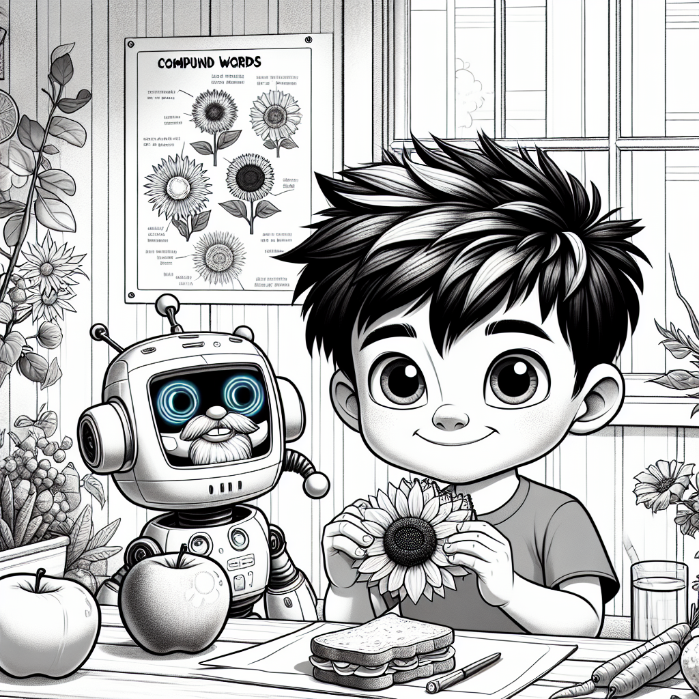

---

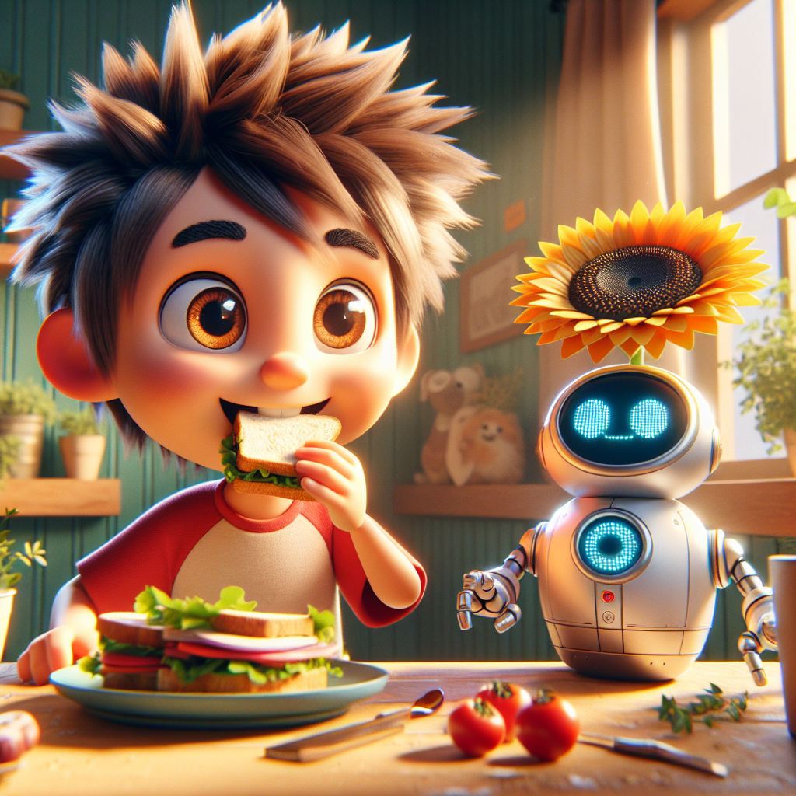

---

Next, Dr. Spark showed them a plate with healthy snacks.

"This is a *sunflower* seed sandwich," he said, holding up a sunflower so they could see the seeds in the center. "Eating nutritious foods helps keep our bodies strong."

Sam took a bite. "Yum! I like *sunflower* seeds," he said, smiling.

"*Sunflower,*" said Robo, processing. "Sun + flower. Another compound word!"

"Exactly!" said Dr. Spark. "Let's find more. What about *sandwich?*"

Sam thought hard. "Sand... wich? Is that one?"

Dr. Spark chuckled. "Actually, *sandwich* is named after a person -- the Earl of Sandwich! Not every word is a compound word, but that's a great question. The best scientists question EVERYTHING."

"But *sandbox* IS a compound word!" said Robo. "Sand + box."

"And *raincoat!*" said Sam, on a roll now. "Rain + coat! I wear my *raincoat* when it rains!"

"*Starfish!*" added Robo. "Star + fish!"

Dr. Spark pulled out a blank poster. "Let's make a compound word chart. Every time you find a new one, add it here."

Sam wrote carefully, sounding out each word. The chart started growing:
- **backpack** (back + pack)
- **sunset** (sun + set)
- **sunflower** (sun + flower)
- **sandbox** (sand + box)
- **rainbow** (rain + bow)
- **raincoat** (rain + coat)
- **starfish** (star + fish)

"Look how many we found!" said Sam. "And the day isn't even over."

They spent the rest of the session discussing healthy habits and practicing new words, dancing and singing about healthy foods and exercises.

"Remember," said Dr. Spark, "a healthy body supports a healthy mind. And a healthy mind asks better questions. And better questions lead to better science."

---

**Interactive Moment:** Let's exercise with Sam and Robo! Stand up and do five jumping jacks! Now stretch your arms up high -- can you reach the sky? Now touch your toes! Great job! Can you think of a compound word that's a healthy food? (Hint: it has "blue" in it... *blueberry!*)

**Question:** What compound word describes a healthy snack that Sam and Robo learned about?
**Answer:** "Sunflower" -- made from "sun" and "flower." Sunflower seeds are a healthy, nutritious snack!

---

## CHAPTER 4: Helping Friends

---

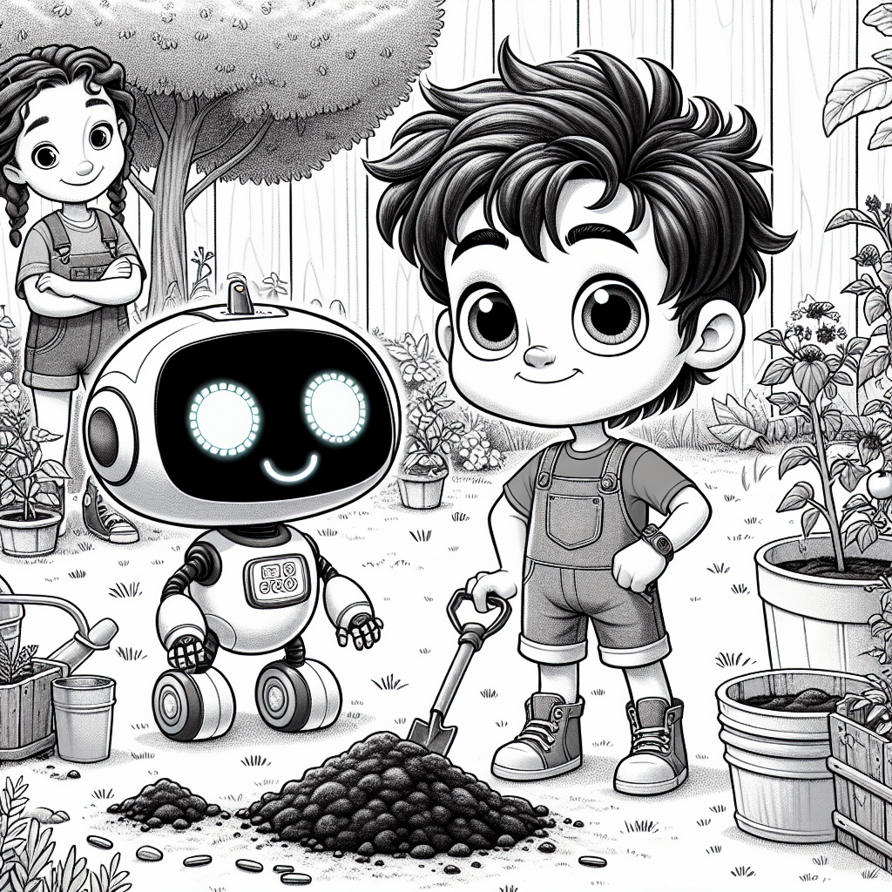

---

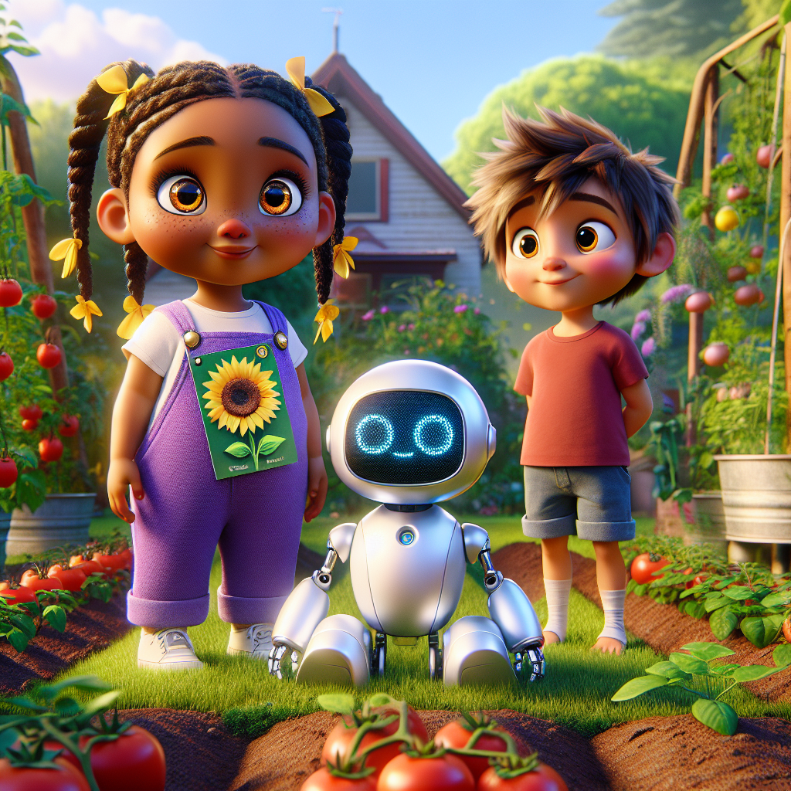

---

One sunny afternoon, Sam and Robo decided to help their friend Lily with a new project.

"I want to grow a *sunflower* plant in my garden!" said Lily, holding up a packet of seeds. "But I've never grown anything before. I don't know where to start."

Sam smiled. "We learned about this at Dr. Spark's lab! We can help. Right, Robo?"

"Absolutely," said Robo. "Growing a plant is a science experiment. And every experiment starts with a plan."

"First, we need some seeds, soil, and water," Sam explained, remembering what Dr. Spark had taught them about plants needing basic things to grow.

They filled a pot with rich, dark soil. Sam dug a small hole with his finger. Lily dropped in the sunflower seeds carefully, one at a time.

"Now, we need to water it," Robo said, gently pouring water into the pot from a small watering can. "Not too much. Plants need water, but they don't want to drown."

"We also need *sunlight,*" Sam added. "Sunflower plants need plenty of sunlight and water to grow strong."

They placed the pot in a sunny spot in the garden, where the afternoon light was warmest.

"*Sunlight,*" said Robo. "Sun + light. Another compound word."

"They're everywhere!" said Lily, laughing.

---

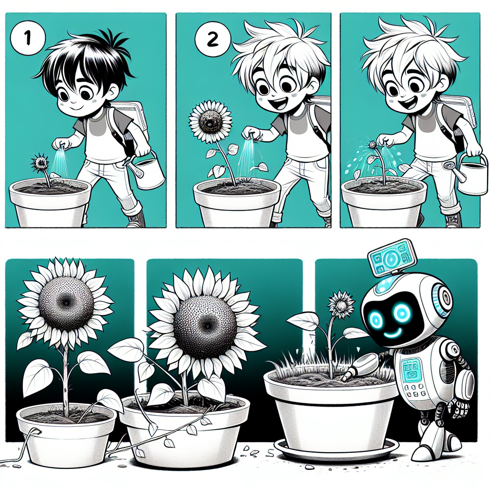

---

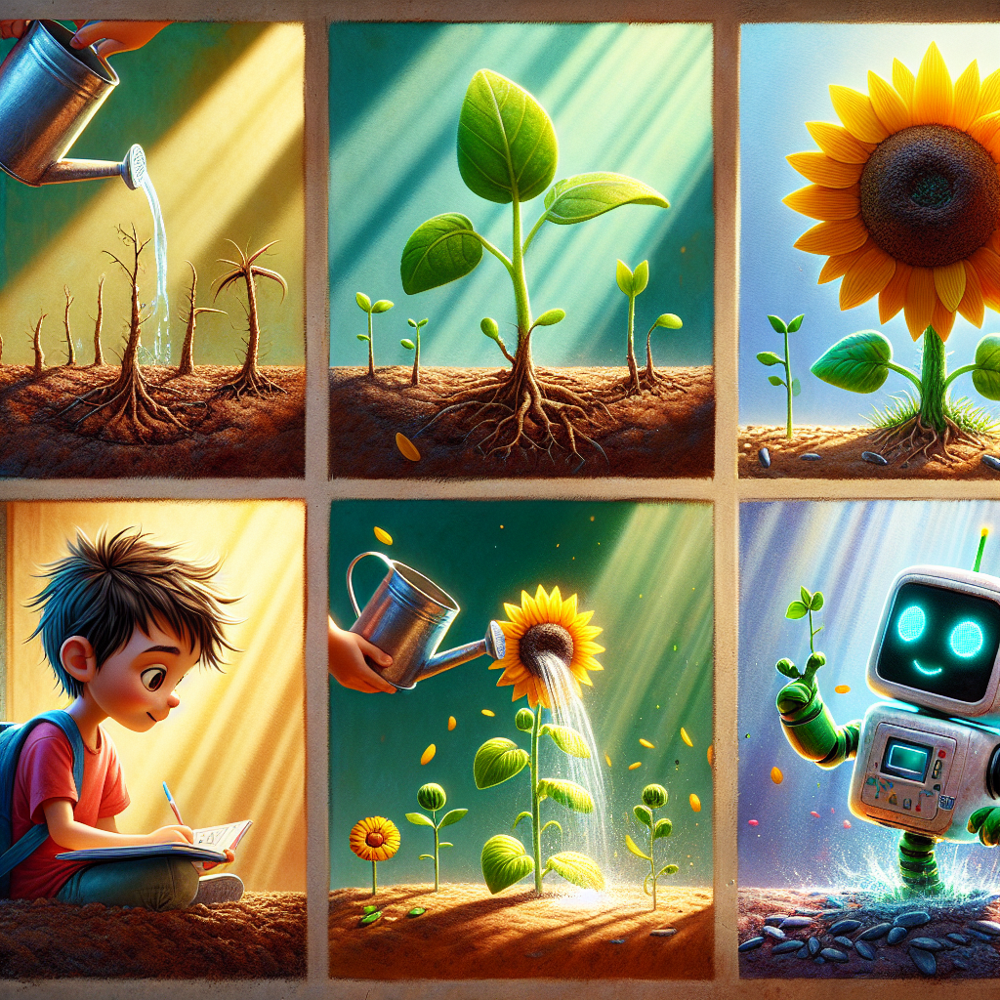

---

Lily was thrilled. "Thank you, Sam and Robo! I'll take good care of my sunflower."

Sam handed her a journal. "Let's keep a journal to observe its growth. We can write down what we see each day. Dr. Spark says real scientists always keep records."

They started the journal together. "Day 1: Planted the sunflower seeds," Sam wrote carefully. He drew a small picture of the pot with the seeds inside.

They continued to help Lily and watched the sunflower grow taller and stronger each day. Each visit, they added to the journal:

*Day 3: A tiny green sprout! It's so small but it's ALIVE.*

*Day 7: The sprout is taller now. It has two little leaves. Lily says they look like baby hands.*

*Day 14: The stem is thick and strong. More leaves. Robo measured it -- 12 centimeters!*

*Day 21: We can see a bud forming at the top! Something is happening...*

*Day 30: THE SUNFLOWER BLOOMED! It's beautiful. Bright yellow. Taller than Sam. Lily cried a little (happy tears).*

"We did it!" said Lily, standing next to her sunflower, which was now taller than she was. "We actually GREW something!"

"YOU did it," said Sam. "We just helped. You watered it every single day. Even when it rained. Even when you couldn't see any change."

"That's called *patience,*" said Robo. "And it's one of the most important things a scientist needs."

Lily touched one of the bright yellow petals. "I'm going to grow MORE things. I want a whole garden."

"That," said Dr. Spark, who had come to see the result, "is exactly how science works. One experiment leads to the next. One question leads to a hundred more. And the more you learn, the more you want to learn."

---

**Interactive Moment:** Sam, Robo, and Lily grew a sunflower! Can you draw a sunflower? Start with a big circle in the middle, then draw petals all around it, then a tall stem with leaves! What would YOU like to grow in a garden?

**Question:** What do sunflower plants need to grow strong?
**Answer:** Plenty of sunlight, water, and good soil -- plus patience! Lily watered her sunflower every single day and kept a journal to track its growth, just like a real scientist.

---

## CHAPTER 5: The Second Superpower

---

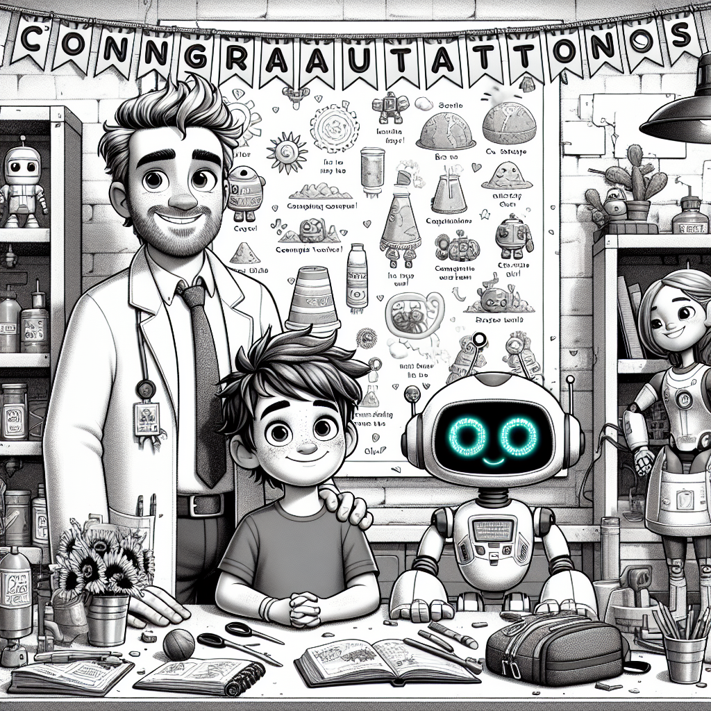

---

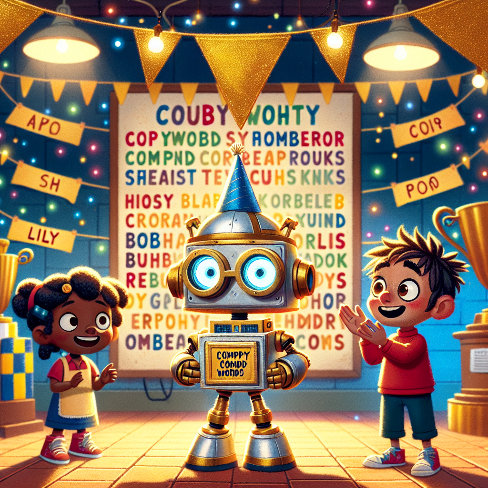

---

As the weeks passed, Sam and Robo continued to learn and grow. One day, Dr. Spark called them for a special meeting.

"Sam, you've done an amazing job," Dr. Spark said, standing next to the big word poster. "But before you earn your new superpower, I want to make sure you truly understand what you've learned. Ready for a review?"

"Ready!" said Sam, standing up straight.

Dr. Spark pointed to the poster. "Tell me every compound word you've learned."

Sam took a deep breath and began:

"*Backpack* -- back plus pack. *Sunset* -- sun plus set. *Sunflower* -- sun plus flower. *Sandbox* -- sand plus box. *Rainbow* -- rain plus bow. *Raincoat* -- rain plus coat. *Starfish* -- star plus fish. *Sunlight* -- sun plus light. *Lunchbox* -- lunch plus box!"

Robo's display showed a counter: **9 compound words!**

"Outstanding," said Dr. Spark. "And your sight words?"

"*Come, here, look, said, they, what,*" Sam recited. "Plus all the ones from Book 1 -- *the, and, can, is, a, my.*"

"Now," said Dr. Spark, his eyes twinkling, "let's review the science. Tell me about the volcano."

Sam's face lit up. "When baking soda and vinegar mix, they create a chemical reaction. The baking soda is a base, the vinegar is an acid, and together they make carbon dioxide gas -- that's what makes the bubbles and the eruption!"

Dr. Spark turned to Lily. "And the sunflower?"

Lily stepped forward. "Plants need soil, water, and sunlight to grow. And patience. LOTS of patience. We kept a journal and tracked every change."

"You've both become real scientists," said Dr. Spark.

---

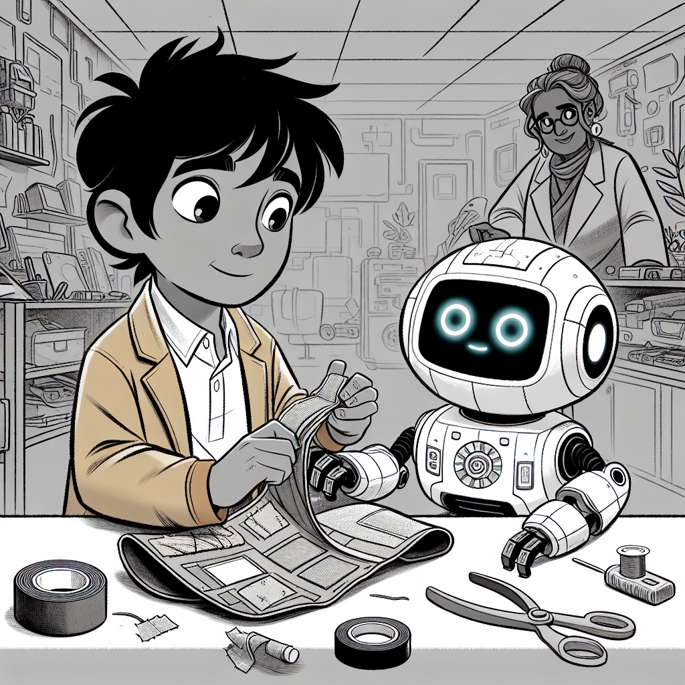

---

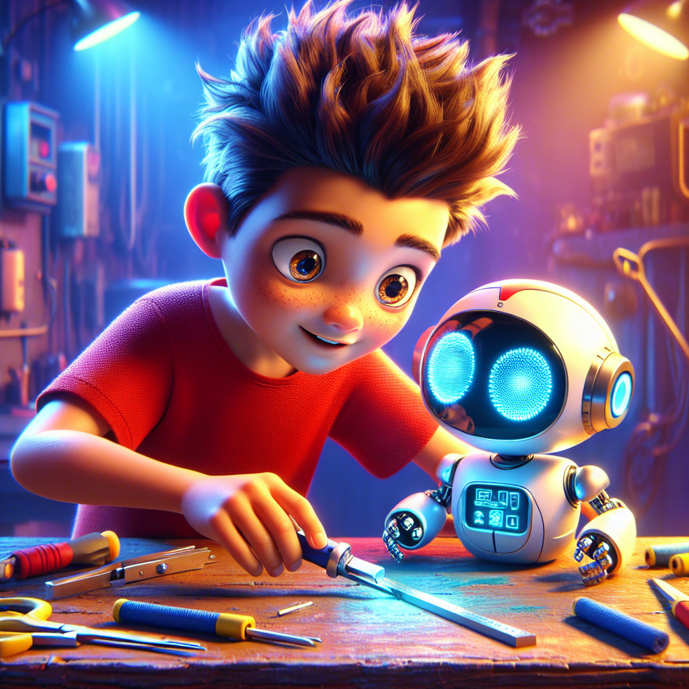

---

"Now, let's use your new skills to help the community," Dr. Spark said. "First task: fix a broken *backpack!*"

A neighbor had brought in a backpack with a torn strap. Sam and Robo got to work.

"First, let's figure out what's wrong," said Sam, turning the backpack over. "Robo, can you scan it?"

Robo's display showed a blueprint of the backpack, highlighting the tear point with a red circle. "The strap has separated from the main body at the stitching line. We need to reattach it."

"So we need thread and a needle," said Sam. "And maybe some tape to reinforce it."

They worked together carefully. Sam held the strap in place while Robo guided the needle through with precision. Then they added reinforcing tape over the repair.

"Done!" Sam exclaimed proudly, holding up the fixed backpack.

Dr. Spark tested the strap with a firm pull. It held strong.

"You've done great, Sam," Dr. Spark praised. "You didn't just fix a backpack. You identified the problem, planned a solution, gathered your materials, and executed the repair. THAT is the scientific method in action."

"Keep using your skills to help others," he added. "Because science isn't just about experiments in a lab. It's about solving problems in the real world."

---

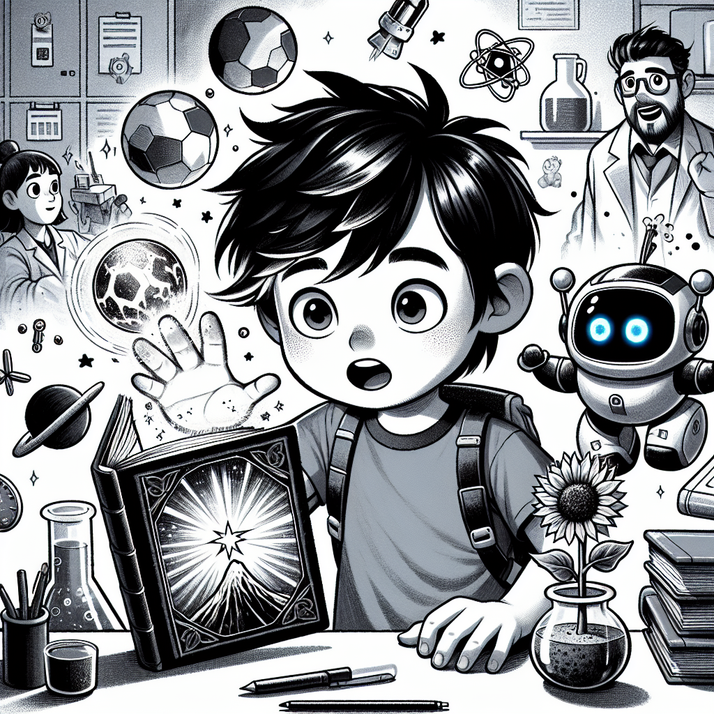

---

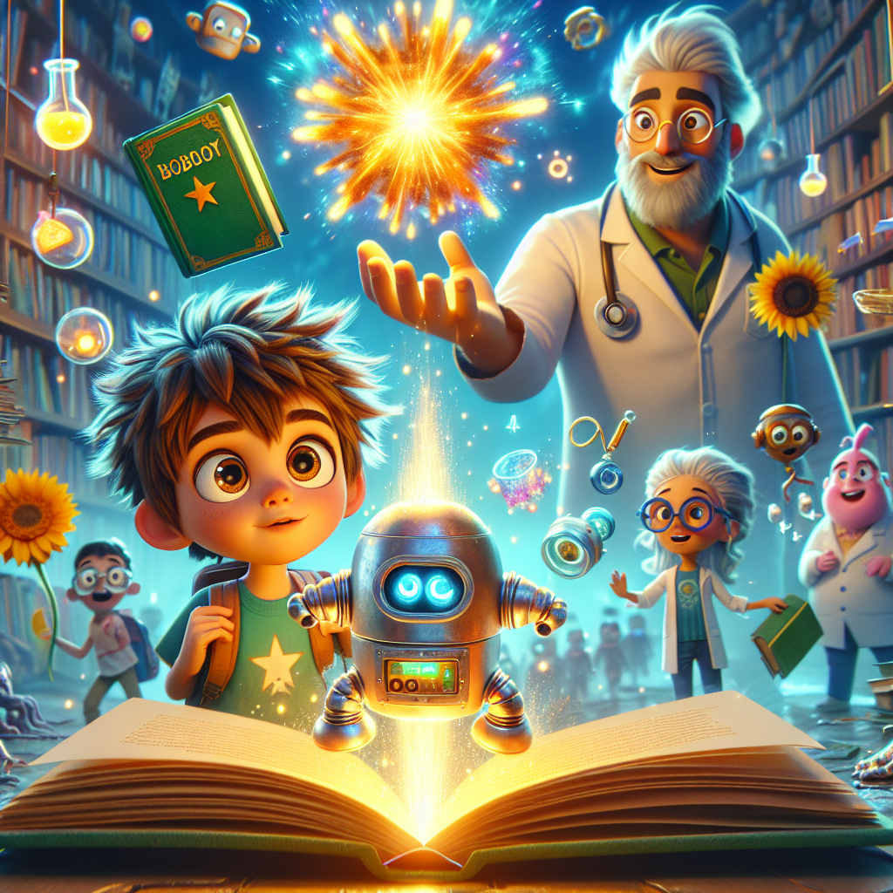

---

Then it happened.

The magical book appeared once more -- floating in the center of the lab, its pages turning in a wind that came from nowhere, just like the first time in Sam's backyard.

But this time, instead of golden light, it pulsed with blue-white light. The color of electricity. The color of ideas.

"Sam," said Robo, his voice quiet with wonder, "the book is responding to you again."

Sam approached slowly. The book was warm. It hummed.

He touched the cover.

And suddenly, everything made sense.

Not just the words. The *connections.* He could see how baking soda and vinegar combined. He could see the chemical formula in his mind. He could see the cells inside the sunflower seed, dividing and growing and reaching toward the sun. He could see how the thread held the backpack strap together, the physics of tension and support.

He could *think* like a scientist.

Not just do experiments -- but understand WHY they worked. And design new ones. And ask questions nobody had asked before.

"Sam," said Dr. Spark, his voice thick with emotion, "you've earned your second superpower: **the ability to perform scientific tasks.**"

Sam looked at his hands. They tingled with possibility.

"I can... I can SEE how things work," he whispered. "I can see the science inside everything."

Robo cheered, his display bursting with icons -- beakers, stars, molecules, equations, a tiny erupting volcano.

Lily clapped and laughed. "You're a real scientist now, Sam!"

Dr. Spark put his hand on Sam's shoulder. "You were always a scientist, Sam. From the moment you asked your first *'why?'* The book just made it official."

---

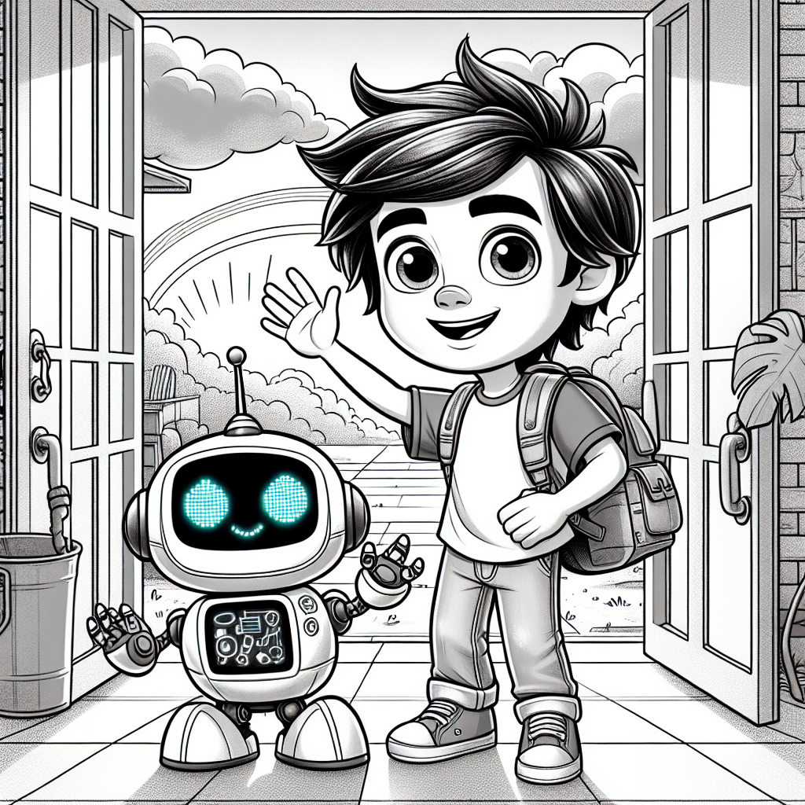

---

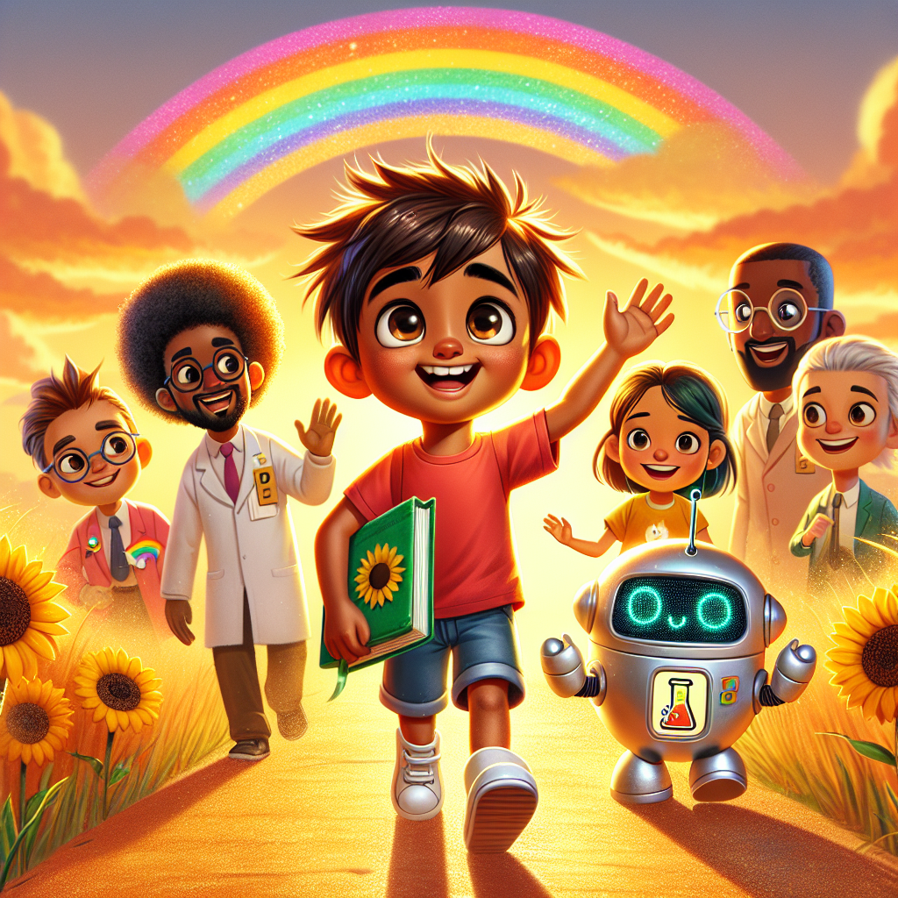

---

With his new superpower, Sam felt ready to tackle any challenge and make the world a better place.

He and Robo danced with joy, knowing that they could make a difference with their newfound knowledge and skills.

"Robo," said Sam as they walked home, a *rainbow* stretching across the sky above them, "I want to remember everything we learned."

"What stands out most?" asked Robo.

Sam thought carefully.

"That science isn't just about cool explosions. It's about asking questions. Being patient. Keeping records. Helping friends. And using what you learn to make things better."

Robo's display showed a small heart next to a small brain.

"And compound words," Sam added, grinning. "*Backpack. Sunset. Sunflower. Rainbow.* Two words that become one. Just like me and you, Robo -- two friends that become a team."

Robo beeped softly. "That is not technically a compound word, Sam. But I appreciate the sentiment very much."

They laughed together.

"What's our next adventure?" asked Sam.

Robo's display flickered. Then it showed a magnifying glass next to a question mark.

"A mystery," said Robo.

Sam's eyes went wide.

"I *can't wait.*"

They set off on their next adventure, excited to see how they could help their friends and community even more.

The *sunset* behind them was the most beautiful one yet.

---

**Interactive Moment:** Sam earned his second superpower! What was YOUR favorite experiment from the book -- the volcano or the sunflower? If you could do any science experiment, what would it be? Tell a friend or grown-up about ONE science fact you learned from this book!

**Question:** What superpower did Sam earn, and how did he earn it?
**Answer:** Sam earned the ability to perform scientific tasks! He earned it by being curious, asking questions, learning about chemical reactions (the volcano), growing a sunflower with patience, and using the scientific method to fix a broken backpack. The magical book recognized his growth and gave him the power to truly think like a scientist.

---

## BACK MATTER

---

### THE LEARNING CORNER
*One page. Circle Time ready. A conversation, not a test.*

**Compound Words: Two Words Become One!**

Sam and Robo discovered that some words are actually TWO words joined together. These are called **compound words!**

It's like a word team-up. Each small word means something on its own, but when they come together, they make a brand new word!

**Can you match these pairs?**
- sun + flower = **sunflower**
- back + pack = **backpack**
- rain + bow = **rainbow**
- sand + box = **sandbox**
- rain + coat = **raincoat**
- star + fish = **starfish**
- sun + light = **sunlight**
- lunch + box = **lunchbox**

**Compound Word Challenge:**
Can you break these compound words apart?
- **butterfly** = ______ + ______
- **bedroom** = ______ + ______
- **football** = ______ + ______
- **toothbrush** = ______ + ______ (hint: remember healthy habits!)

**Sight Words Sam learned in this book:**
- **come** -- "Come here, Sam!"
- **here** -- "Look over here!"
- **look** -- "Look at this experiment!"
- **said** -- Dr. Spark said, "Welcome!"
- **they** -- They planted the seeds.
- **what** -- "What happens when we add vinegar?"

**Circle Time Discussion Questions:**
1. Can you think of a compound word that has "sun" in it? How about "rain"?
2. What was your favorite experiment -- the volcano or the sunflower?
3. Sam learned that science is about asking "why?" What is something YOU would like to ask "why?" about?

---

### THE VALUES MOMENT
*Direct, warm address to the reader.*

Sam learned some big things on this adventure.

He learned that **curiosity** isn't just a feeling -- it's a SKILL. When you wonder "why does that happen?" or "how does that work?" you're doing what every great scientist has ever done.

He learned that **patience** makes all the difference. The sunflower didn't grow in one day. It took weeks of watering, watching, and waiting. The best things in life are like that -- they take time.

He learned that **healthy habits** support everything else. You can't ask great questions or run great experiments if you don't take care of your body and mind. Exercise, eat well, and rest.

He learned that **helping friends** is the best use of knowledge. Sam didn't keep his science skills to himself -- he used them to help Lily grow her sunflower and to fix a neighbor's backpack.

And he learned that **asking questions** is never, ever something to be embarrassed about. The smartest people in the world are the ones who keep asking.

What question would YOU like to answer? What experiment would YOU like to try?

You don't need a fancy lab. You just need curiosity, patience, and a friend.

---

### ACTIVITY SUGGESTION
*Simple. 15 minutes. No special supplies needed.*

**Make Your Own "Science Journal"**

Sam and Lily kept a journal to track their sunflower's growth -- and you can make one too!

Grab a notebook (or fold some paper in half and staple it). Write "MY SCIENCE JOURNAL" on the cover. Decorate it however you like!

Now, pick something to observe. It can be:
- A plant (does it grow toward the window?)
- The weather (sunny, cloudy, rainy? Draw a picture each day!)
- An animal (what does a bird do in the morning? Where does a squirrel go?)
- The moon (what shape is it tonight? Draw it!)

Every day, write or draw what you see. Just like Sam, you're doing real science -- observing, recording, and learning.

**Bonus experiment:** Put a celery stalk in a glass of water with food coloring. Check it every day. What happens? (Write it in your journal!)

---

### NOTE FOR GROWN-UPS
*For parents, teachers, librarians, and caregivers.*

**Sam's Second Superpower** is designed to introduce scientific thinking, compound words, and healthy habits to children ages 3-8 through an adventure-driven story that builds on Book 1's foundation of curiosity, kindness, and phonics.

**Educational alignment:**
- **Phonics:** Compound words (backpack, sunset, sunflower, sandbox, rainbow, raincoat, starfish, sunlight, lunchbox) and sight words (come, here, look, said, they, what) are woven naturally into the story and dialogue, with characters actively identifying and building compound words together.
- **CCSS Standards:** RL.K.1 (ask and answer questions), RL.K.2 (retell and identify central message), RL.K.3 (identify characters, settings, events), RL.1.2 (central message/lesson), RF.K.3 (phonics and word recognition), RF.1.3 (decoding -- including compound words)
- **CASEL Competencies:** Self-Management (patience with the sunflower), Responsible Decision-Making (scientific method), Relationship Skills (teamwork with Lily)

**STEM Concepts Covered:**
- Chemical reactions: acid-base reaction (baking soda + vinegar volcano)
- States of matter: gas (carbon dioxide), liquids, solids
- Plant biology: seed germination, photosynthesis basics, growth requirements
- Observation and recording: the science journal
- Engineering and problem-solving: fixing the broken backpack
- Nutrition science: healthy foods, exercise, the body as a system

**Values from the Twelve Pillars:**
- Curiosity and Love of Learning (core theme -- "Question everything")
- Patience and Perseverance (30-day sunflower growth)
- Healthy Habits and Self-Care (exercise, nutrition)
- Helping Friends and Community (helping Lily, fixing the backpack)
- Respect for Knowledge and Elders (Dr. Spark as mentor)
- Hard Work (every experiment requires effort and care)

**Circle Time Tips:**
- This book works best read aloud with pauses at each Interactive Moment.
- The volcano experiment can be replicated in the classroom with simple supplies (baking soda, vinegar, food coloring, a container). Do it AFTER reading Chapter 2 for maximum engagement.
- Start a class science journal after reading Chapter 4. Each child can track a different observation.
- The compound word activities work well as word-wall additions -- post new compound words as children discover them.

**Coloring Pages:**
Each left-hand page features a B&W line illustration of the facing scene, designed for children to color during or after reading. This dual format supports both active engagement during circle time and quiet individual activity.

**Series Connection:**
This is Book 2 of 5. Sam's second superpower -- performing scientific tasks -- combines with his first (understanding animals) in later books. The phonics progression continues: Book 1 covered CVC patterns, Book 2 covers compound words, Book 3 will introduce blends and digraphs, Book 4 introduces long vowels with silent e, and Book 5 reviews all patterns for fluency.

*Available through Follett Content and Mackin for school and library purchase.*

---

### ALL FIVE SUPERPOWERS (So Far!)

| Book | Superpower | What Sam Learned |
|------|-----------|-----------------|
| 1 | Understanding Animals | Listen. Be kind. Show up for others. |
| **2** | **Scientific Tasks** | **Be curious. Be patient. Ask "why?"** |
| 3 | Heightened Senses | *Coming in Book 3...* |
| 4 | Communicate with Nature | *Coming in Book 4...* |
| 5 | ??? | *Coming in Book 5...* |

---

*Everlight Kids -- A division of Everlight Ventures*
*"Every word is a door. And every door is an adventure."*

---

End of Master Manuscript -- Sam's Second Superpower v2.0
Next steps: illustration production (B&W coloring + full color) | editorial review | KDP upload
