# Sam's First Superpower
## Adventures with Sam and Robo -- Book 1
### Everlight Kids | Everlight Ventures

---

**Document Status:** PRODUCTION DRAFT v2.0
**Date:** March 2, 2026
**Format:** 5 Chapters | Interactive Moments | Q&A | Coloring Book Hybrid
**Page Layout:** Left page = B&W coloring illustration | Right page = Full color illustration
**Phonics Focus:** CVC patterns (at, an, it, og, ub) + basic sight words (the, and, can, is, a, my)
**Core Value:** Curiosity, kindness, healthy habits, emotional awareness, hard work
**CASEL Competencies:** Self-Awareness, Social Awareness, Responsible Decision-Making
**CCSS Alignment:** RL.K.1, RL.K.2, RL.K.3, RL.K.10, RF.K.2, RF.K.3
**Superpower Unlocked:** The ability to understand and communicate with animals
**Target Age:** 3-8 (readers 5-7 / listeners 3-5)
**Series Position:** Book 1 of 5 | The beginning of Sam and Robo's adventure

---

## CHAPTER 1: The Magical Book

---

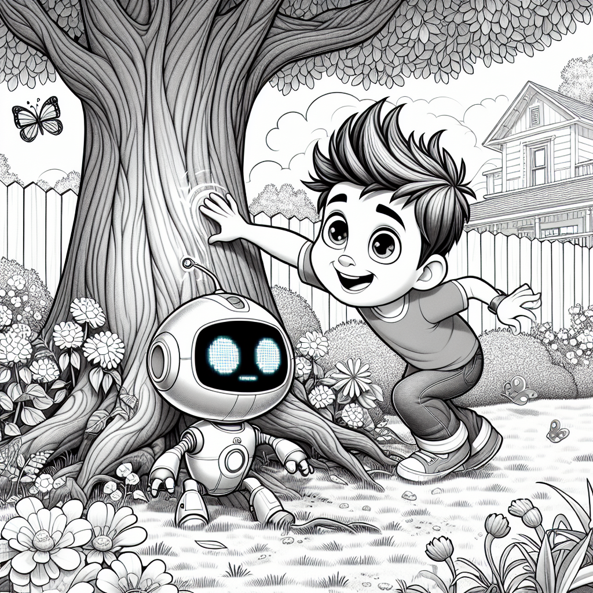

---

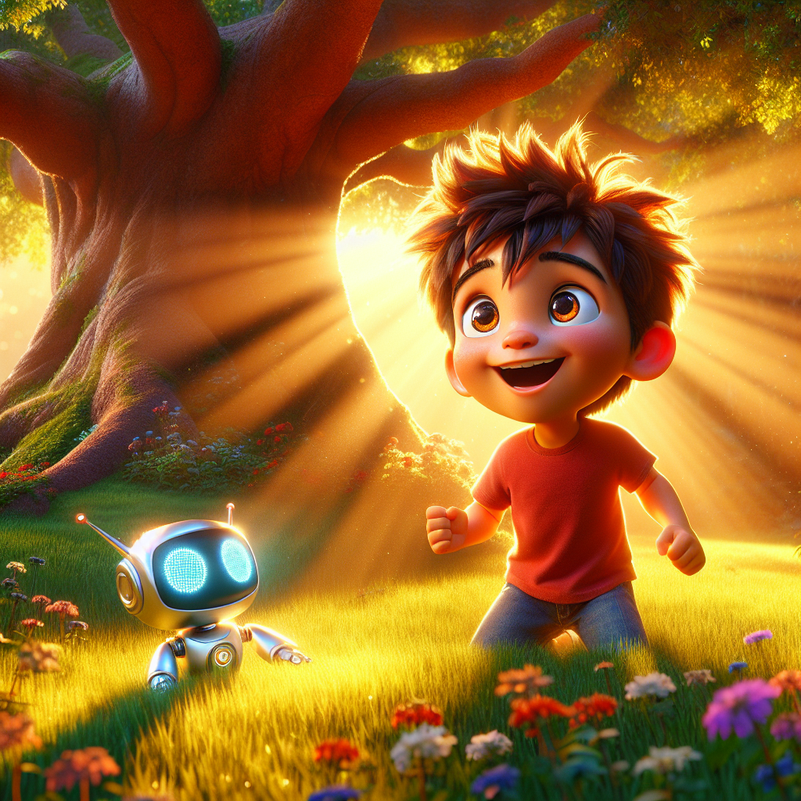

---

Sam was a curious boy who loved adventures.

He loved climbing trees. He loved asking questions. He loved finding things that nobody else had noticed.

One sunny afternoon, while playing in his backyard, Sam spotted something strange near the old oak tree. Something was *glowing* beneath the roots.

He crouched down and reached carefully into the gap.

"What's this?" Sam whispered.

It was a book. But not just any book. It was shiny and warm and hummed like it was alive. The cover sparkled with tiny golden stars, and right in the middle, in letters that seemed to *move,* it said:

**THE BOOK OF SUPERPOWERS**

Sam's eyes went wide. "A book of *superpowers?*"

He sat down in the grass and carefully opened the cover.

---

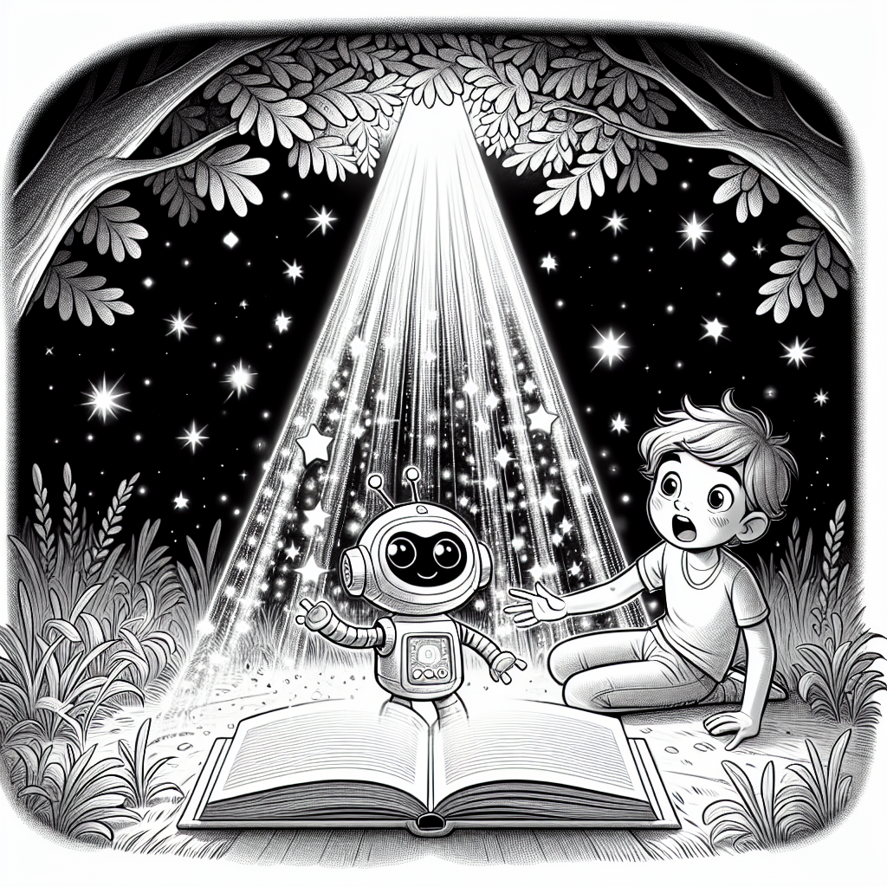

---

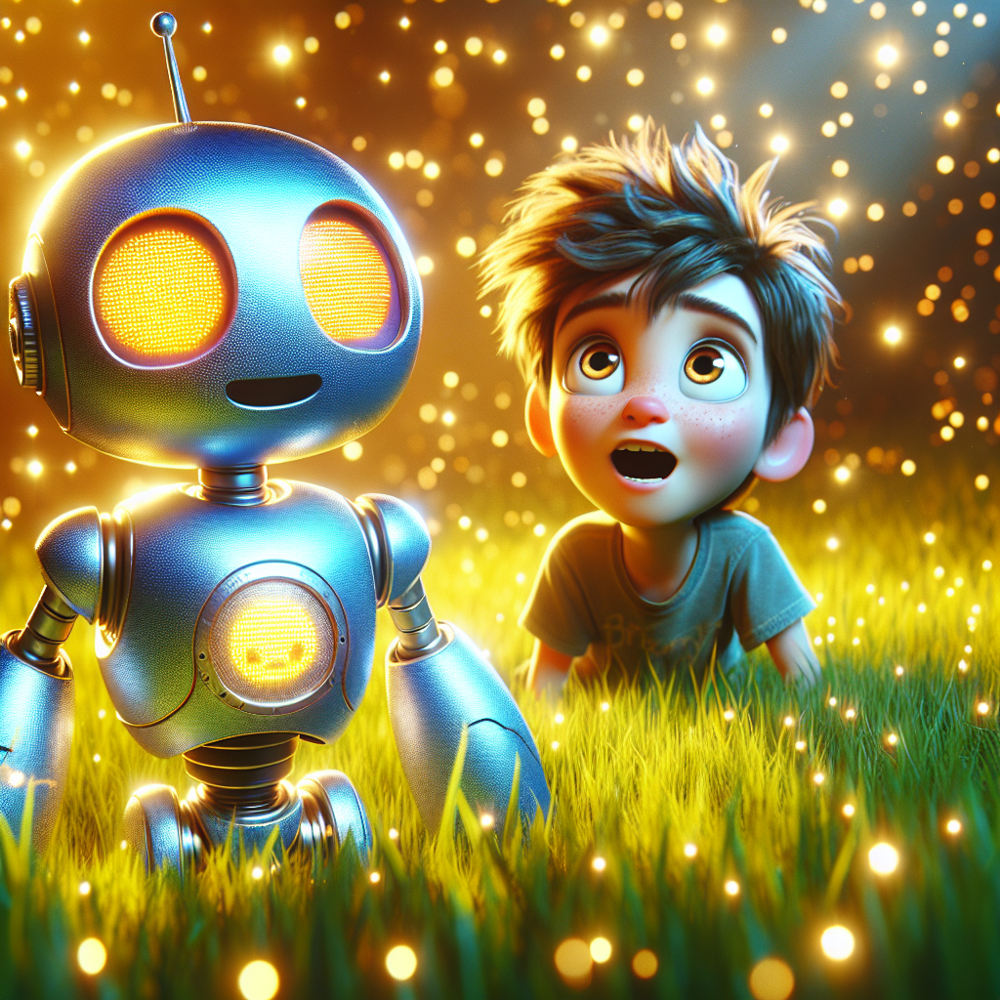

---

And out popped Robo.

A small, friendly robot with round features and big, kind eyes. His chest had a glowing display screen, and right now it showed a bright, happy face.

"Hello, Sam!" Robo said cheerfully. "I'm Robo. I'm here to help you learn and go on amazing adventures!"

Sam blinked. Then he grinned the biggest grin of his life.

"Wow! This is going to be fun!"

Robo beeped happily. His display changed to show a small open book icon.

"Before we begin our first adventure," said Robo, "I want to teach you something important. Words are powerful, Sam. Every word you learn is like a key that opens a new door."

"A key?" said Sam.

"Yes. And today, we're going to learn some very important sounds." Robo's display showed three letter groups: **at, an, it.**

"Repeat after me," said Robo. "*Cat. Hat. Bat.* Can you hear the *at* sound?"

"*Cat! Hat! Bat!*" Sam repeated, bouncing on his toes. "They all end in *at!*"

"Excellent!" said Robo. "Now try these: *can, man, ran.* What sound do you hear?"

"*An!*" said Sam. "Can, man, ran -- they all have *an!*"

"One more," said Robo. "*Sit, bit, fit.* What's the pattern?"

Sam thought for one second. "*It!* They all end in *it!*"

Robo's display exploded with tiny fireworks. "Perfect, Sam. You're a natural. Now -- are you ready for your first adventure?"

Sam grabbed his backpack and pulled the straps tight.

"I was *born* ready."

---

**Interactive Moment:** Can you help Sam practice his new sounds? Say three words that end in *at.* Now three that end in *an.* Now three that end in *it.* How many can you think of?

**Question:** What did Sam find under the old oak tree in his backyard?
**Answer:** A glowing magical book called "The Book of Superpowers" -- and when he opened it, out popped his new friend, Robo!

---

## CHAPTER 2: The Adventure Begins

---

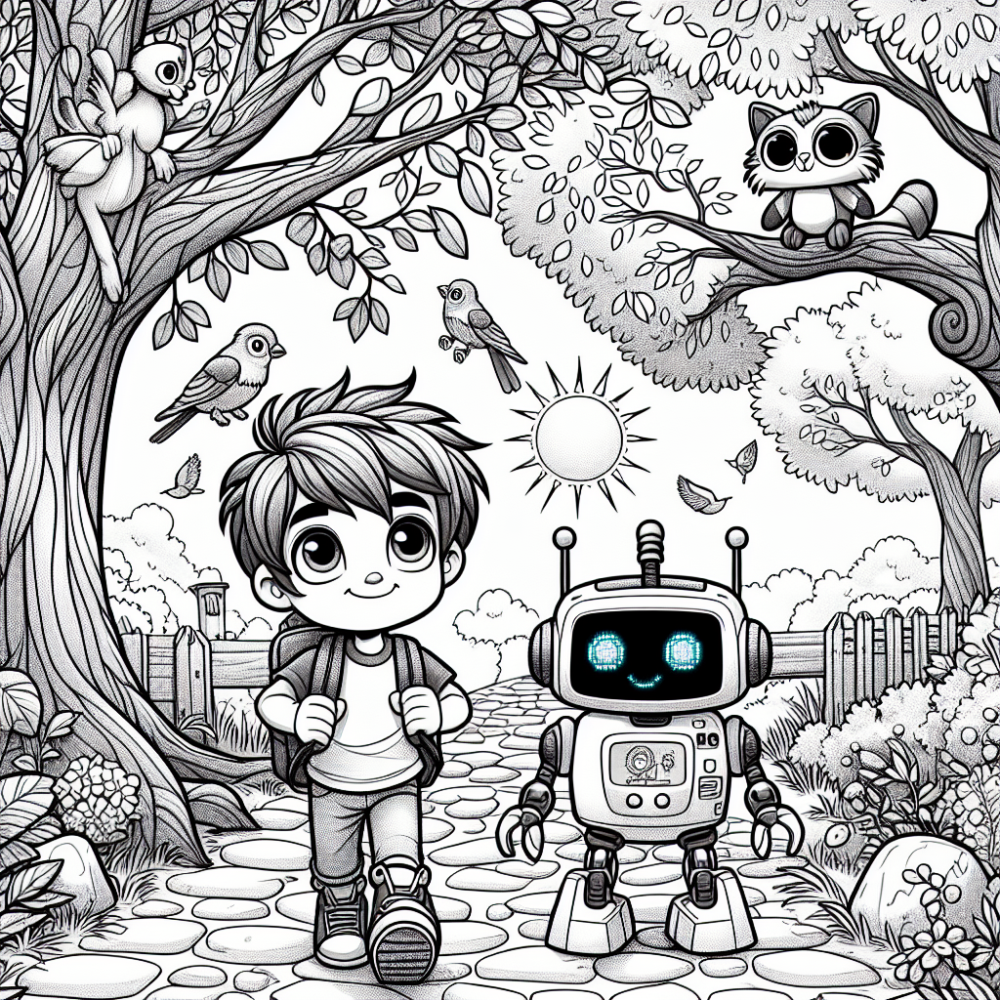

---

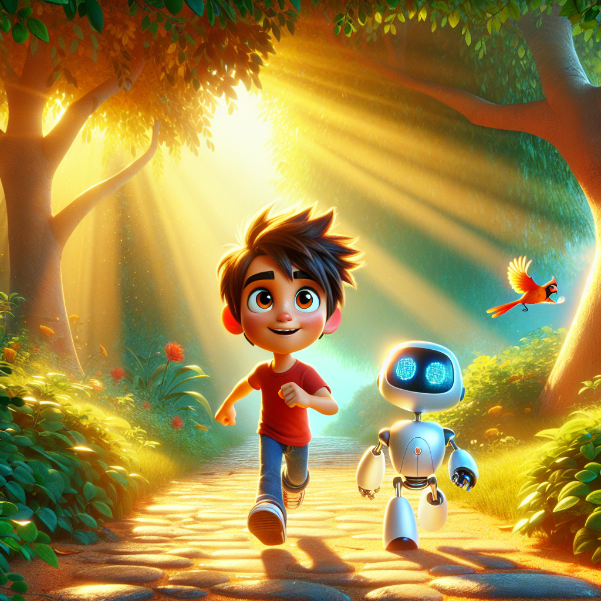

---

Sam and Robo set off together, following a winding path through the neighborhood.

As they walked, Robo continued their lesson.

"Sam, let me teach you some important sight words -- words you'll see everywhere. Ready?"

"Ready!" said Sam.

"*The. And. Can.* These words are special because you'll find them in almost every book you ever read."

"*The* cat. Sam *and* Robo. I *can* do it!" Sam said, making sentences on the spot.

Robo's display showed a gold star. "You're already using them. Well done."

Suddenly, they heard a sound.

"*Meoooow!*"

Sam stopped. He tilted his head and listened.

"That sounds like a *cat,*" he said. "*Cat* -- that's one of our *at* words!"

"Correct!" said Robo. "Where is it coming from?"

They followed the sound to a tall tree at the edge of the park. Up near the top, clinging to a branch, was a small orange cat. Her eyes were wide and scared.

"She's stuck!" said Sam. "We have to help her."

---

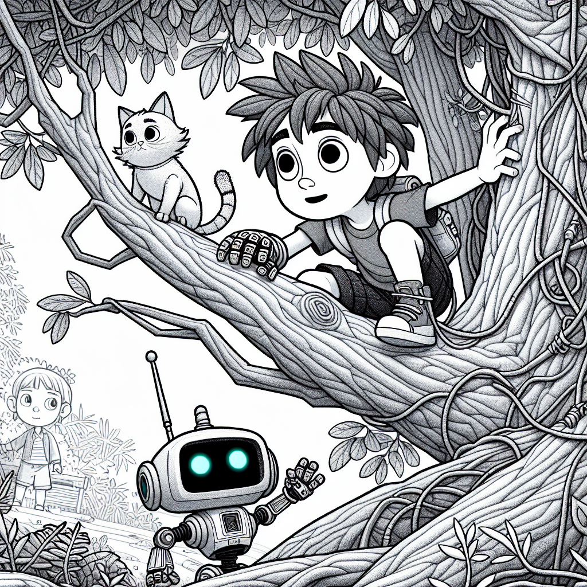

---

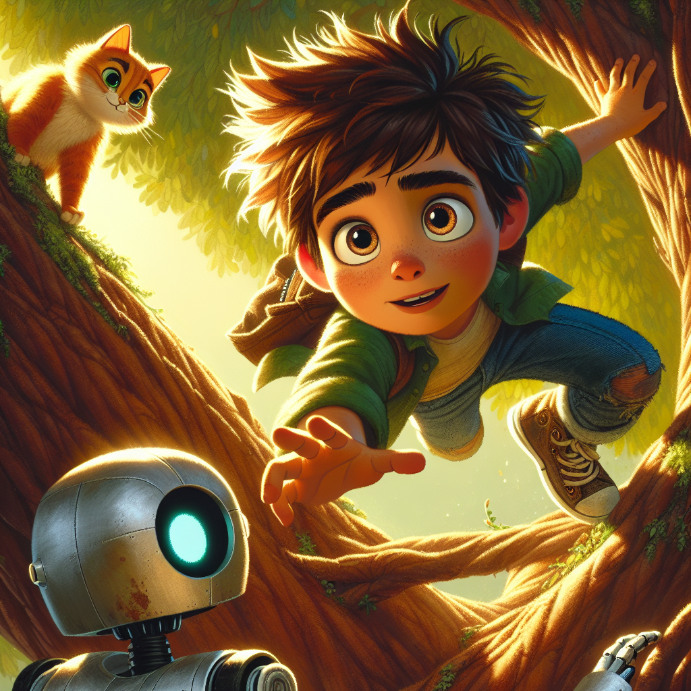

---

Sam looked at the tree. It was tall. But the cat needed help.

"I *can* do this," Sam said. He used his new word -- *can* -- and he meant it.

He climbed carefully, one branch at a time. Robo watched from below, his display tracking Sam's progress with a small climbing figure.

"You're doing great, Sam!" Robo called up. "Steady and careful."

Near the top, Sam reached out his hand gently. "It's okay, kitty. I'm here to help. Come here, *cat.*"

He said the word softly, the way you'd say something kind to a friend.

The cat looked at him. She blinked slowly. Then she leaned forward and let Sam scoop her up carefully with one arm.

The cat leaped into Sam's arms, purring happily.

Sam climbed back down, step by step, holding the cat close. When he reached the ground, the cat rubbed her head against his chin.

"You did it, Sam!" said Robo. "You used your words AND your kindness."

A small girl ran over -- the cat's owner. "You found Whiskers! Thank you so much!"

"You're welcome," said Sam. "She was just scared. She needed someone to *come* to her."

Robo's display showed a small note: **come** -- a new sight word!

Sam smiled. "We're learning words AND helping friends. This is the best day ever."

"The adventure is just beginning," said Robo.

---

**Interactive Moment:** Sam had to be brave to climb the tree! Can you think of a time you were brave to help someone? What words would you use to calm a scared animal? Practice saying them softly and gently.

**Question:** How did Sam help the cat that was stuck in the tree?
**Answer:** Sam bravely climbed the tree, spoke gently to the scared cat, and carefully carried her back down to safety.

---

## CHAPTER 3: Healthy Habits

---

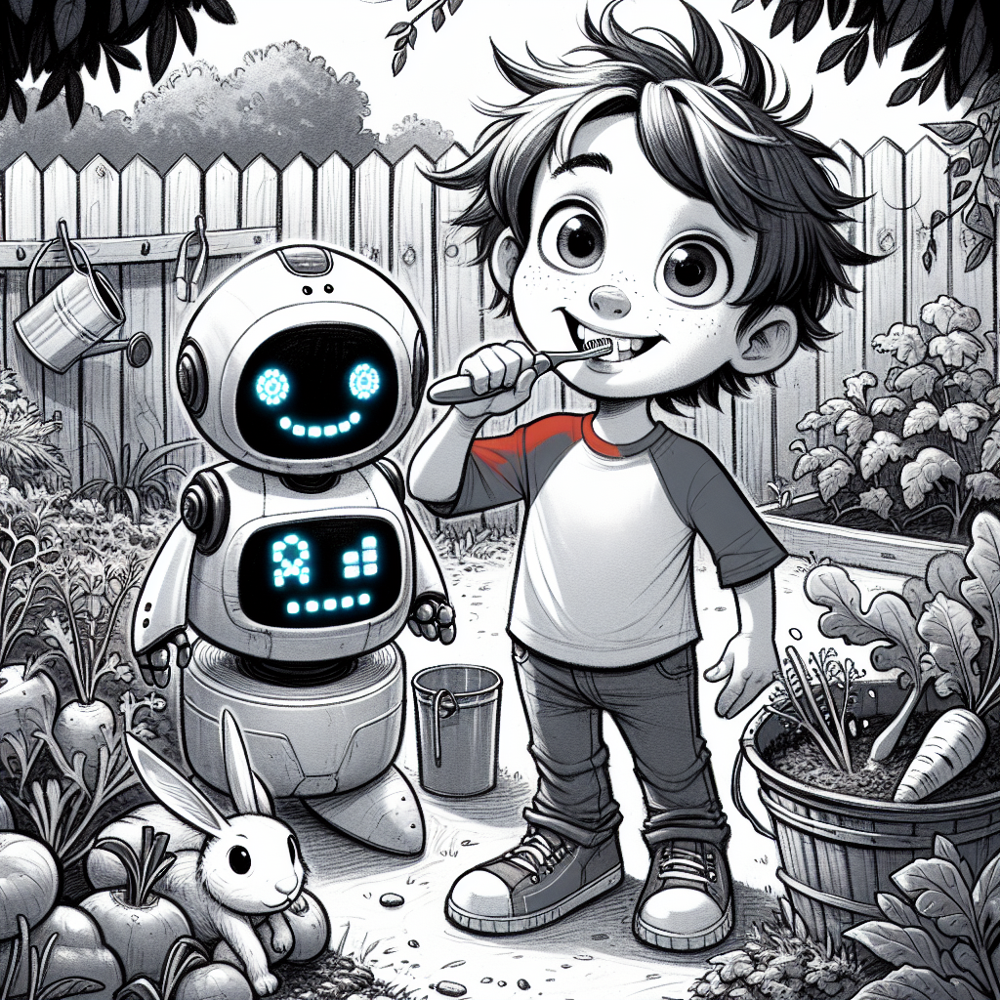

---

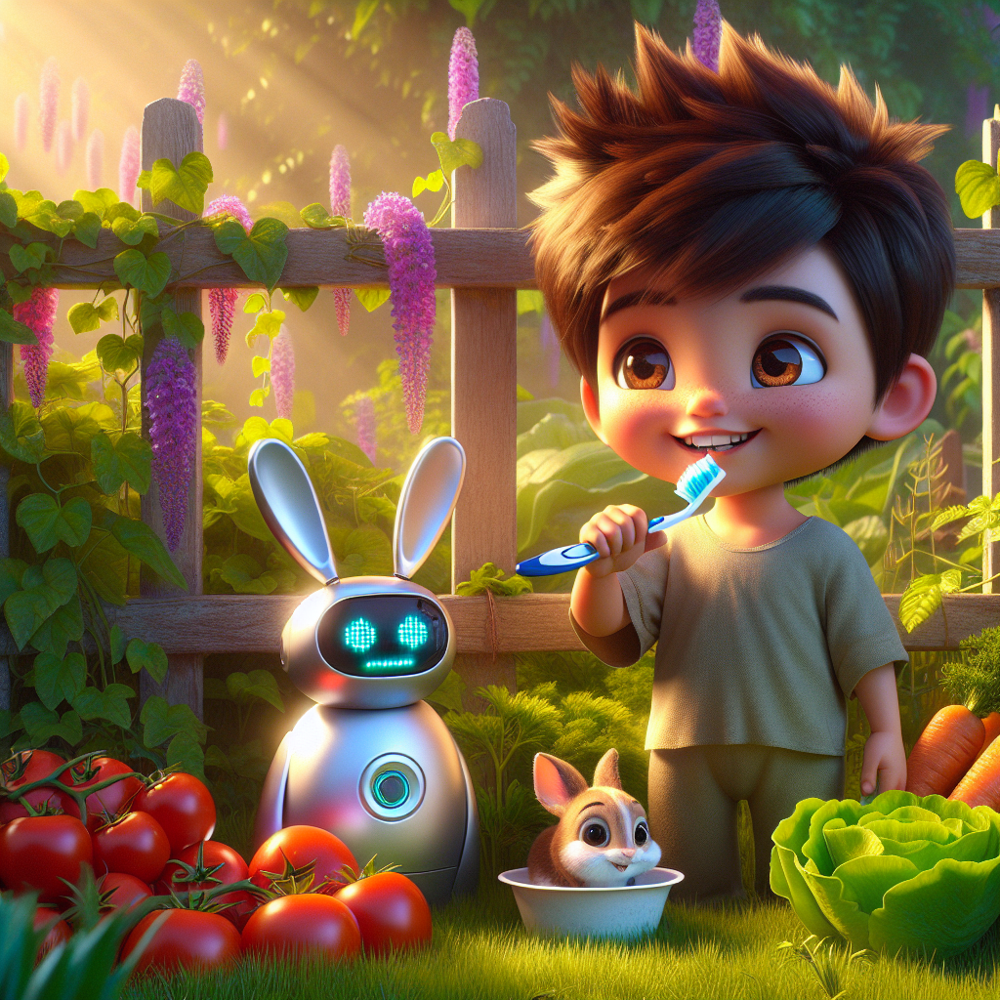

---

As Sam and Robo continued their adventure, Robo had something important to teach.

"Sam, superpowers aren't just about adventures," said Robo. "They're also about taking care of yourself. That's called *healthy habits.*"

"Like what?" asked Sam.

"Like brushing your teeth every morning and every night," said Robo. His display showed a sparkling tooth icon. "Healthy teeth help you eat well, speak clearly, and smile big."

Sam nodded proudly. "I brush my teeth every morning AND every night! My grandma taught me that."

"Your grandmother is wise," said Robo. "What else did she teach you?"

"She says eating vegetables makes you strong. And that your body is a gift, so you should take care of it."

Robo's display showed a small flexing arm. "She is absolutely correct. Eating vegetables gives your body the fuel it needs -- like how I need to charge my battery."

They walked into a community garden, where rows of vegetables grew in neat lines. Carrots, lettuce, tomatoes, and peppers -- all growing strong in the warm sun.

Then Sam noticed something.

A small rabbit was sitting at the edge of the garden, nose twitching, looking at the vegetables with hungry eyes.

"Robo, look! That rabbit is hungry. Can we help?"

---

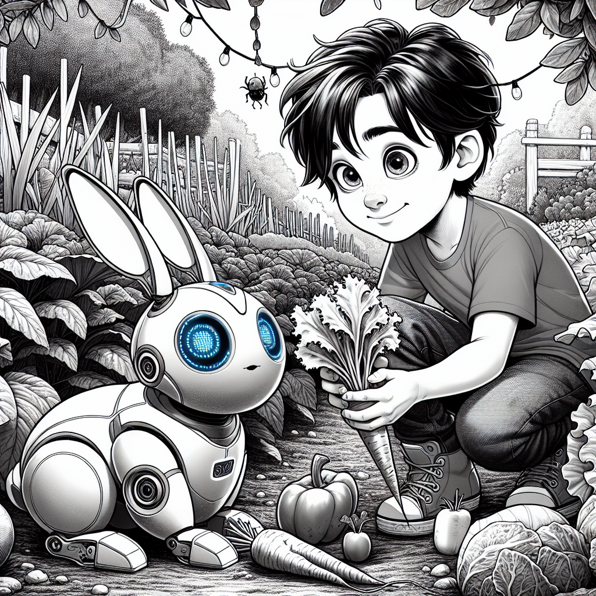

---

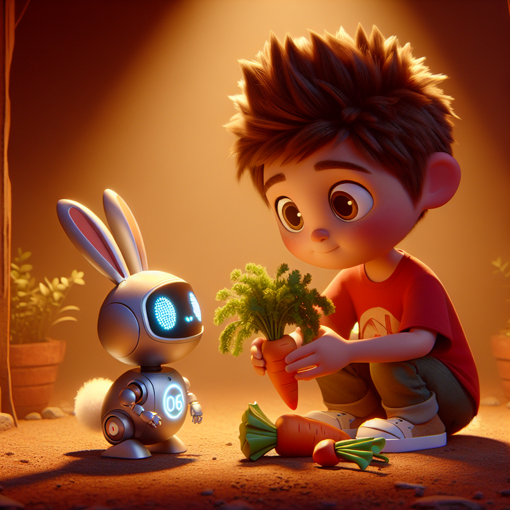

---

"Let's help the rabbit find some healthy vegetables," said Robo.

Sam carefully gathered some carrots and lettuce. He crouched down low and held them out gently, the way his grandma had taught him to feed the birds.

"Here you go, little guy," Sam said softly. "*Carrot* and *lettuce.* Good food for a hungry rabbit."

The rabbit hopped forward, sniffed Sam's hand, and began to nibble happily.

"Sam," said Robo quietly, "did you notice? *Rabbit, carrot, lettuce.* Say them slowly."

"Rab-*bit.* Car-*rot.* Let-*tuce.*"

"The *it* sound -- you've heard it before!" said Robo. "And *carrot* -- can you hear the *at* hiding inside? Car-*rot* is close, but listen: 'the *fat* carrot sat on the *mat.*'"

Sam laughed. "Now you're making silly sentences!"

"Silly sentences are the best way to remember sounds," said Robo, his display showing the words with the patterns highlighted.

Sam watched the rabbit eat and felt something warm in his chest. It wasn't a superpower. It was just... good. Taking care of something that needed you -- that felt good.

"Robo," Sam said, "I think healthy habits aren't just about taking care of yourself. They're about taking care of everything around you, too."

Robo's display changed to a small glowing heart.

"I think you're right, Sam."

---

**Interactive Moment:** Can you name three healthy habits that Sam and Robo talked about? Now stand up and show Sam your best vegetable! Pretend you're a tall carrot growing in the garden. Now pretend you're a round tomato. What's YOUR favorite vegetable?

**Question:** What did Sam and Robo gather for the hungry rabbit?
**Answer:** They gathered carrots and lettuce from the garden -- healthy vegetables that helped feed the hungry rabbit.

---

## CHAPTER 4: Sam's Smart Heart

---

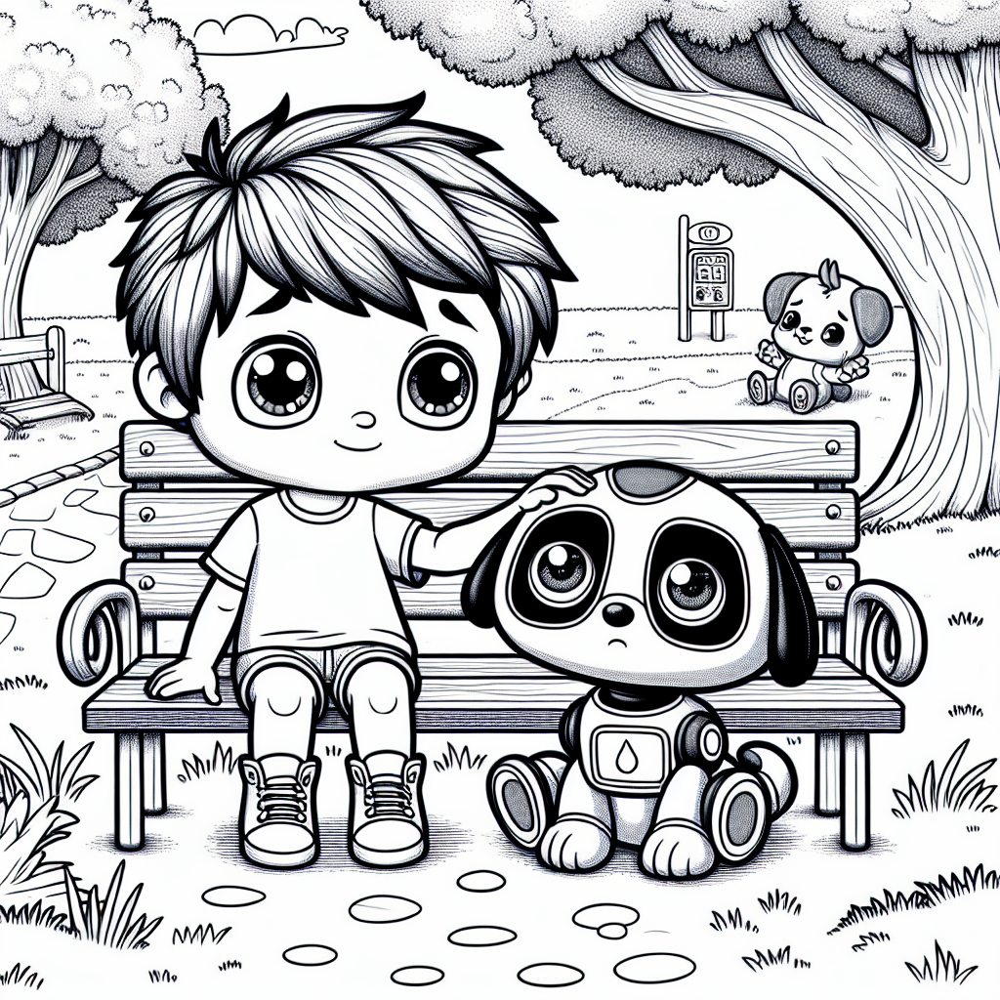

---

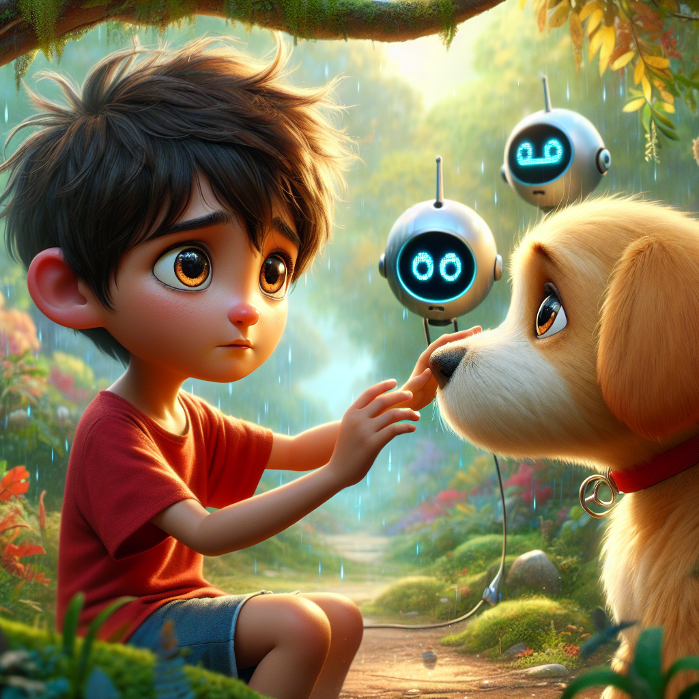

---

Later that day, Sam and Robo came to a quiet park. And there, sitting all alone on the path, was a small puppy.

Its ears were droopy. Its tail was tucked. And its eyes were the saddest eyes Sam had ever seen.

"Oh no," said Sam. "That puppy looks so *sad.*"

"He does," said Robo. "Sam, this is something very important. Feelings are real, and they matter -- in animals AND in people. When someone feels sad, the most powerful thing you can do is simply be *there.*"

"What do I do?" asked Sam.

"You don't have to fix it," said Robo gently. "You just have to *show up.*"

Sam sat down on the ground next to the puppy. He didn't grab it. He didn't make loud sounds. He just sat there, quiet and close.

Then, softly, he said: "It's okay, puppy. I'm right here. Everything is going to be alright."

He reached out slowly and petted the puppy's head, gentle and steady.

The puppy looked up at Sam. Its tail gave one small wag. Then another. Then it leaned into Sam's side and let out a long, shaky sigh.

"He feels better," Sam whispered.

"He feels *safe,*" said Robo. "Because you made him feel safe. That's called *empathy* -- understanding how someone else feels and showing them you care."

---

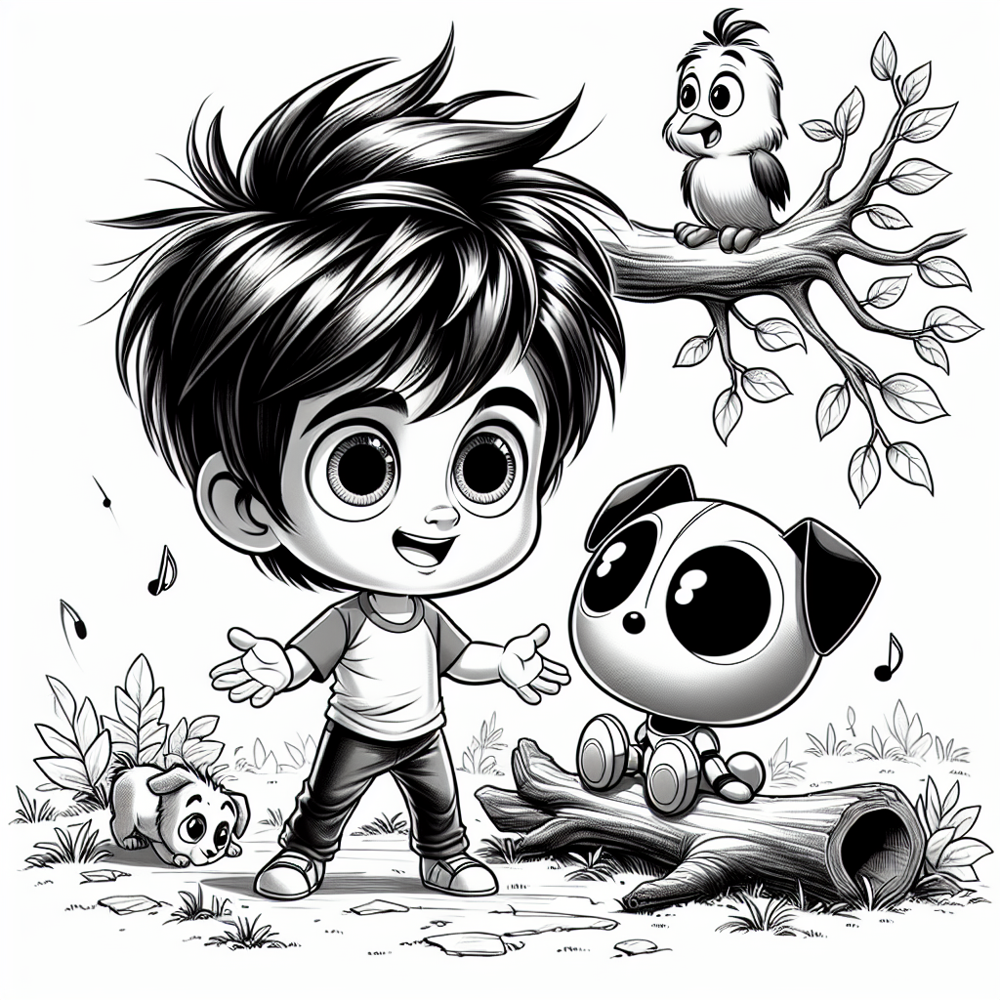

---

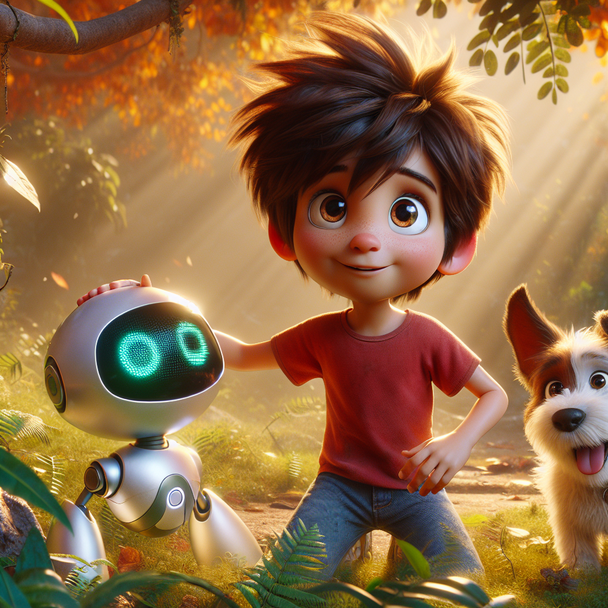

---

Just then, they heard an angry sound from the tree above.

*"CHIRP! CHIRP! CHIRP!"*

A small bird sat on a branch, feathers all puffed up, wings spread, chirping furiously at everything.

"That bird is *angry,*" said Sam.

"He is," said Robo. "Anger is a real feeling too, Sam. And it usually means something underneath it -- something scared, or hurt, or frustrated."

Sam thought about that. Then he looked up at the bird and spoke softly.

"Hey, bird. It's okay. I know you're upset. But we're not here to bother you. We're friends."

The bird tilted its head. It chirped once more, but softer.

"Calm down, little bird," Sam said, his voice steady and warm. "We're here to help."

The bird blinked. Its feathers slowly settled. Its wings folded back. And then -- it chirped a quiet, peaceful song.

Robo's display showed a heart with a small brain inside it.

"Sam, what you just did is called *emotional intelligence.* You recognized feelings in others -- sadness in the puppy, anger in the bird -- and you responded with patience and kindness."

"My grandma calls that having a *smart heart,*" said Sam.

"Your grandma," said Robo, "is a very wise woman."

Sam looked at the happy puppy and the calm bird. He felt something inside him growing -- not a superpower, not yet. But something. Like a seed that had just found sunlight.

"Robo," Sam said, "I think understanding feelings might be the most important thing we've learned today."

"I think you might be right," said Robo. And his display showed a small seed, sprouting.

---

**Interactive Moment:** Sam showed empathy by being gentle with the puppy and patient with the bird. Can you show Sam what a SAD face looks like? Now show him an ANGRY face. Now show him a HAPPY face! What would YOU say to a friend who is feeling sad?

**Question:** How did Sam help the sad puppy and the angry bird?
**Answer:** Sam showed empathy -- he sat quietly with the sad puppy and spoke gently until it felt safe, and he spoke calmly to the angry bird until it relaxed. He used his "smart heart" to understand their feelings.

---

## CHAPTER 5: The First Superpower

---

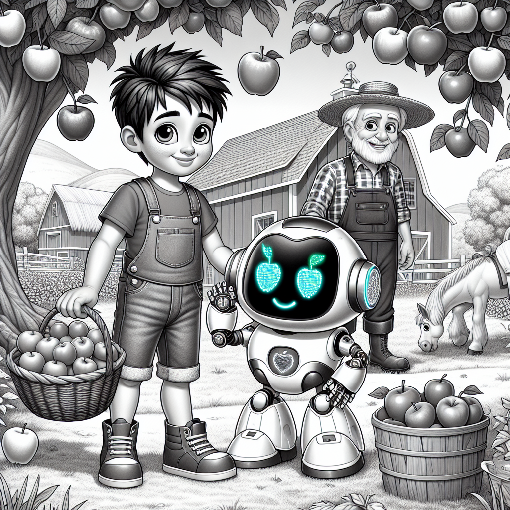

---

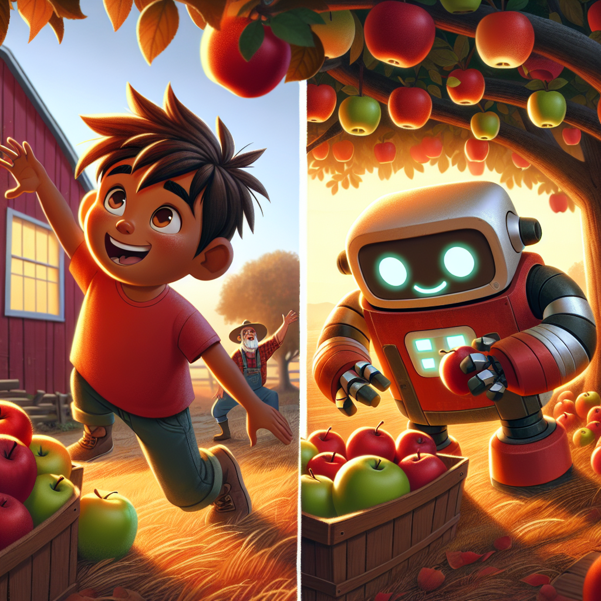

---

As they continued their adventure, Sam and Robo came to a farm where an old farmer was working alone.

The farmer had a straw hat, worn overalls, and hands that looked like they'd worked every day for fifty years. He was trying to pick apples from a tree, but there were too many for one man.

"Excuse me, sir," said Sam. "Do you need help?"

The farmer looked down at Sam and smiled. "Well, I sure do. These apples aren't going to pick themselves, and my old arms get tired faster than they used to."

"We'll help!" said Sam. "Right, Robo?"

Robo beeped. "Absolutely. Helping others is one of the most important things a person -- or a robot -- can do."

Sam and Robo got to work. Sam reached up on his tiptoes to pick the low-hanging apples. Robo used his extending arms to reach the higher ones. The farmer showed them which apples were ready -- the ones that came off the branch with a gentle twist.

"Not too hard," said the farmer. "You don't *yank* an apple. You let it tell you when it's ready."

"That's like the bird!" said Sam. "You have to be patient."

The farmer chuckled. "Sounds like you've already learned a lot today, son."

---

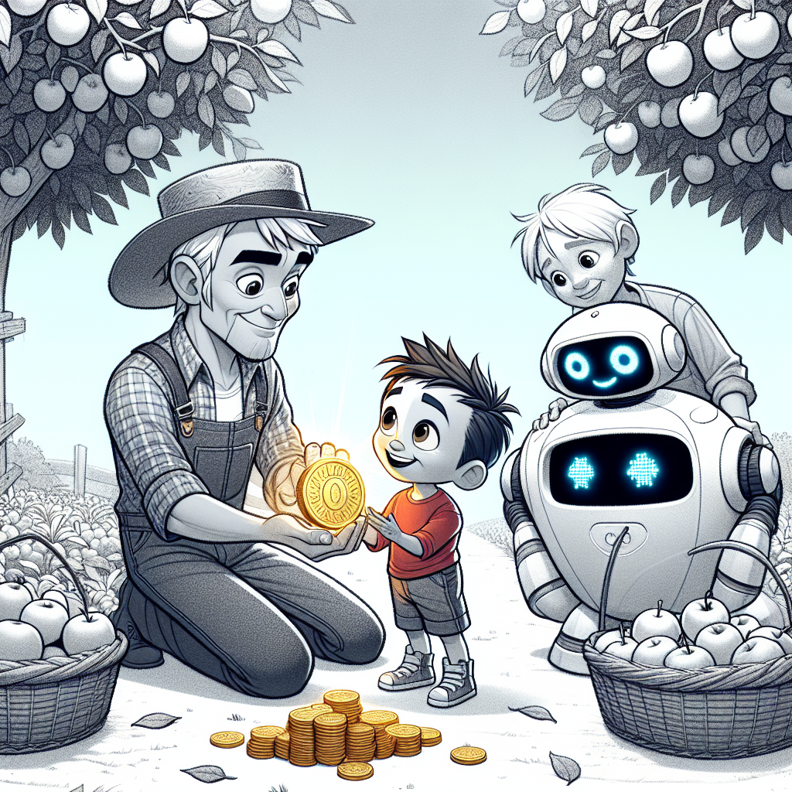

---

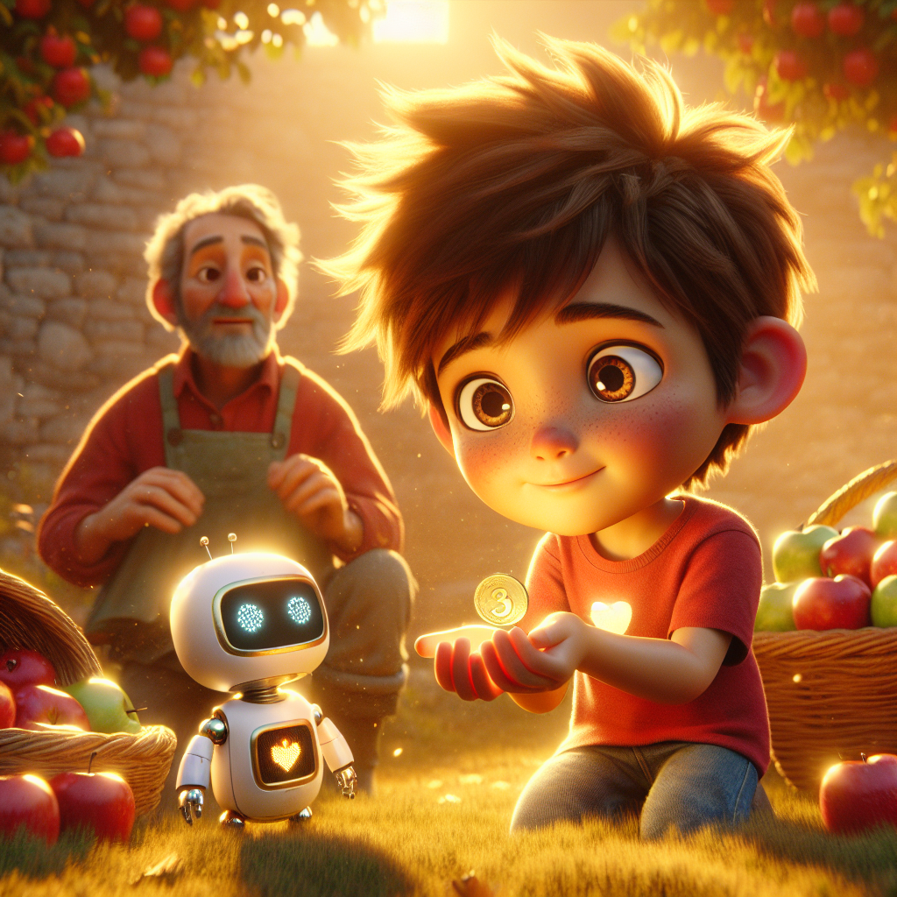

---

When they were finished, the farmer reached into his pocket and held something out to Sam.

"You worked hard today," said the farmer. "And hard work deserves to be recognized."

It was a special coin. Not just any coin -- it had a small star on the front and the words *"WELL EARNED"* around the edge.

Sam held it in both hands. "Thank you, sir."

"You earned it," said the farmer. "Don't forget that word -- *earned.* It means you worked for it. And things you earn mean more than things that are just handed to you."

Robo added gently, "Remember, Sam -- it's important to work hard to earn rewards. And sometimes, it's wise to *save* what you earn."

Sam looked at the coin and made a decision.

"I'll save this for something important," he said. "Something really, really important."

The farmer nodded. "That's wisdom, right there. Your family raised you well."

---

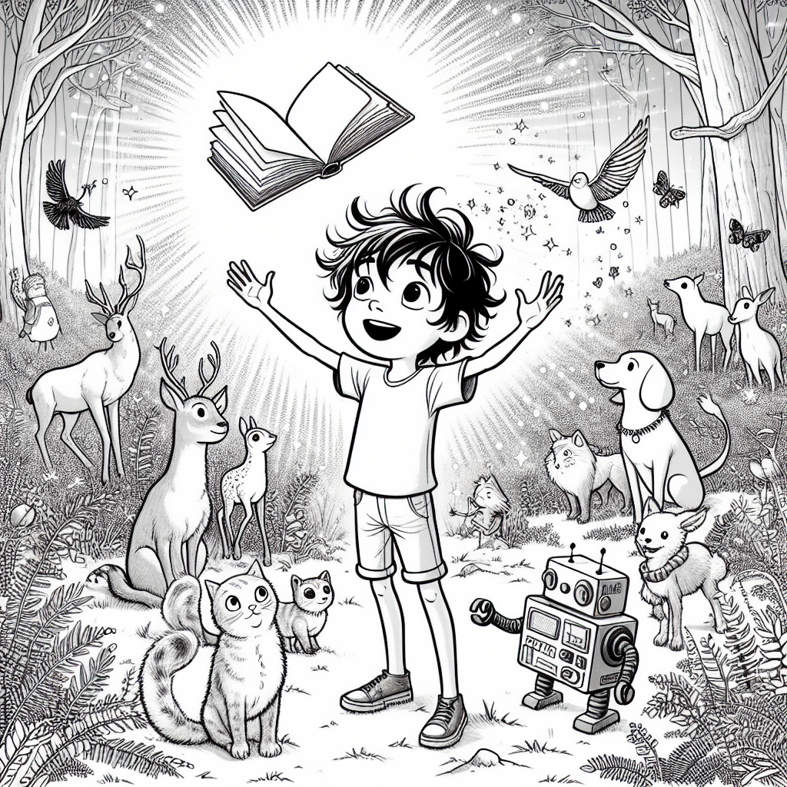

---

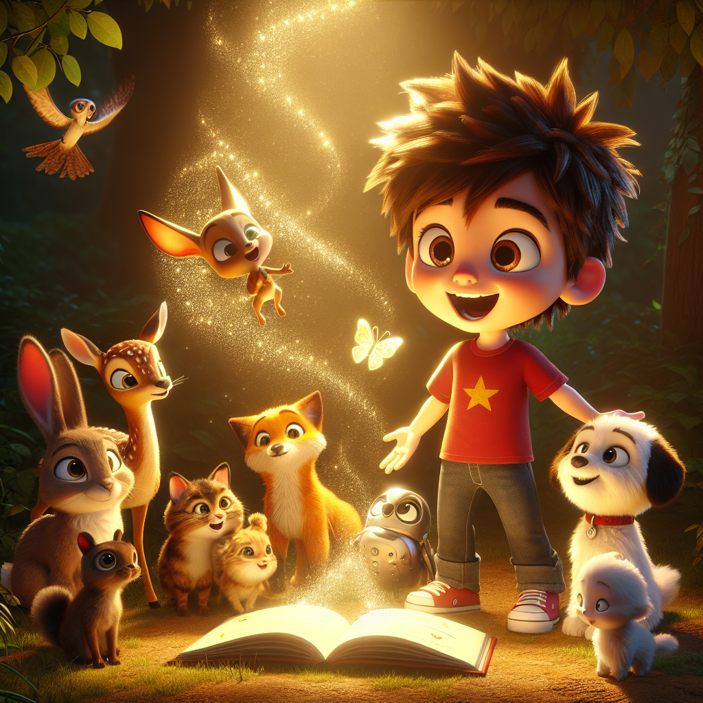

---

As the sun began to set, painting the sky in orange and gold, something extraordinary happened.

The magical book appeared before Sam, hovering in the air, its pages fluttering in a wind that came from nowhere.

And from behind every tree, every bush, every hiding spot -- the animals came.

The cat he had rescued from the tree. The rabbit he had fed in the garden. The puppy whose sadness he had soothed. The bird whose anger he had calmed.

And more. Animals he hadn't even met yet -- a deer, a squirrel, a butterfly -- all stepping forward, all looking at Sam with something in their eyes.

*Trust.*

Robo's display glowed bright. "Sam... the book is responding to everything you've done today."

The book pulsed with light.

And suddenly, Sam could *hear* them.

Not just sounds. *Words.*

The cat purred: "Thank you for climbing up to get me."

The rabbit twitched its nose: "Thank you for feeding me."

The puppy wagged its tail: "Thank you for sitting with me when I was sad."

The bird sang: "Thank you for being patient when I was angry."

Sam's mouth fell open.

"I... I can *understand* them. Robo -- I can understand what they're *saying!*"

Robo smiled -- or did the robot equivalent, his display showing a burst of golden light.

"Sam, you've earned your first superpower: **the ability to understand and communicate with animals!**"

Sam looked at all the animals gathered around him. His eyes were shining.

"This is the most amazing thing that has ever happened to me," he whispered.

But the deer stepped forward and said something that made Sam go very still.

"You didn't get this power because of magic, Sam. You got it because you *listened.* You got it because you were *kind.* The magic just helped us say thank you."

Sam felt tears prick his eyes. Not sad tears. The good kind.

He knelt down and the puppy immediately jumped into his arms. The cat rubbed against his legs. The bird landed on his shoulder.

"I promise," Sam said to all of them, "I will always listen. I will always be kind. And I will use this power to help every animal I can."

---

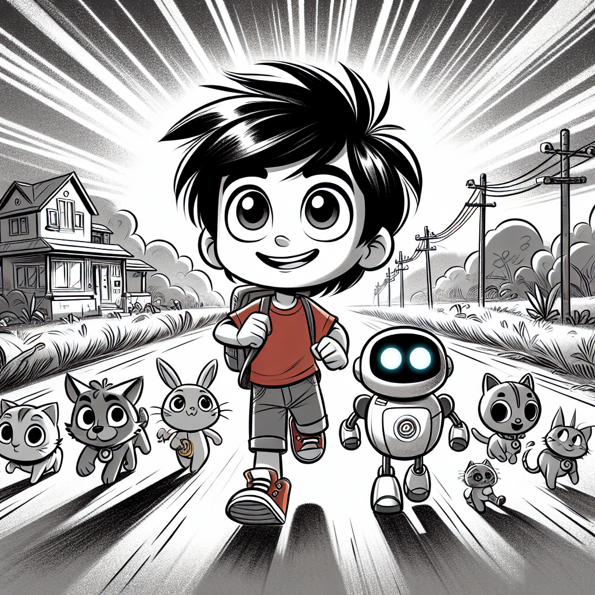

---

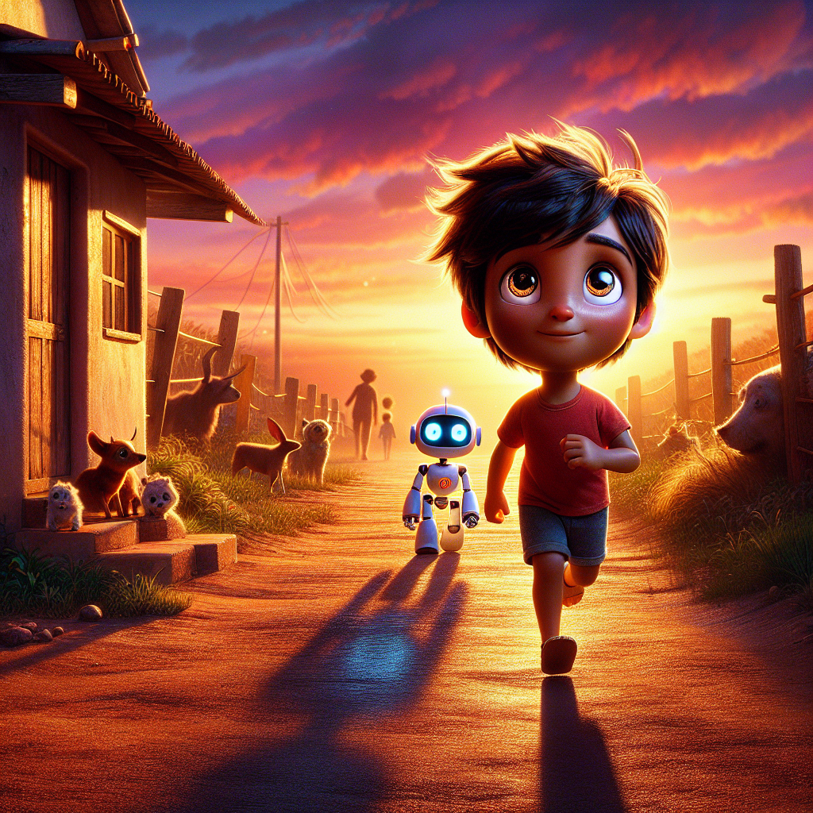

---

Sam thanked Robo for the adventures and the lessons learned. He felt proud of his new skills and looked forward to more adventures.

"I can't wait for our next adventure, Robo!" Sam said as they walked toward home.

"There are many more adventures ahead, Sam," Robo replied. His display showed a small *2* -- a hint of what was coming next.

"But remember what you learned today. Curiosity opens doors. Kindness earns trust. Healthy habits make you strong. Understanding feelings makes you wise. And hard work is always -- *always* -- worth it."

Sam thought about everything. The book. Robo. The sounds -- *at, an, it.* The cat in the tree. The vegetables in the garden. The sad puppy. The angry bird. The farmer. The coin.

And now, the animals. His animals. His friends.

He reached into his backpack and touched the special coin.

*Well earned.*

Yes, it was.

"Robo?" said Sam as they reached the front door.

"Yes, Sam?"

"What's our next adventure going to be about?"

Robo paused. His display flickered for a moment, then showed a small beaker bubbling with liquid.

"*Science,*" said Robo.

Sam grinned.

"I *can't wait.*"

---

**Interactive Moment:** Sam earned his first superpower! If YOU could talk to animals, which animal would you talk to first? What would you ask them? Stand up and pretend you're your favorite animal -- can your friends guess which one you are?

**Question:** What superpower did Sam earn, and how did he earn it?
**Answer:** Sam earned the ability to understand and communicate with animals. He earned it by being curious, kind, gentle, patient, and hardworking -- by showing every animal he met that he truly cared.

---

## BACK MATTER

---

### THE LEARNING CORNER
*One page. Circle Time ready. A conversation, not a test.*

**CVC Sounds: Building Blocks of Reading**

Sam and Robo learned some very important sounds today -- the building blocks that help you read!

A **CVC word** has three sounds: a Consonant, a Vowel, and a Consonant. Like building blocks that snap together!

**The -at family:**
- **c**at -- the cat in the tree!
- **h**at -- the farmer's straw hat!
- **b**at -- what you play baseball with!
- **s**at -- Sam sat on the ground with the puppy!
- **m**at -- the mat by the front door!

**The -an family:**
- **c**an -- "I CAN do this!" (Sam's favorite word)
- **m**an -- the kind farmer man!
- **r**an -- Sam ran to help the cat!

**The -it family:**
- **s**it -- Sam sat still next to the puppy
- **b**it -- a little bit of lettuce for the rabbit
- **f**it -- the apple fit perfectly in Sam's hand

**Sight Words Sam learned:**
- **the** -- the cat, the book, the farmer
- **and** -- Sam and Robo
- **can** -- "I can do this!"
- **is** -- "This is going to be fun!"
- **a** -- a book, a coin, a friend
- **my** -- "My grandma taught me that"

**Circle Time Discussion Questions:**
1. Can you clap out the sounds in the word *cat*? (c-a-t -- three claps!)
2. What new sight word did Sam learn when he helped the cat's owner? (*come*)
3. Can you think of a word that rhymes with *hat*? How about *man*? How about *sit*?

---

### THE VALUES MOMENT
*Direct, warm address to the reader.*

Sam learned some really important things on his very first adventure.

He learned that **curiosity** is the beginning of everything good. When you ask "what's that?" or "why?" or "how?" -- you're opening a door to something amazing.

He learned that **kindness** is its own superpower. The cat trusted Sam because he was gentle. The rabbit came close because Sam was patient. The bird calmed down because Sam was calm first.

He learned that **healthy habits** -- brushing your teeth, eating vegetables, taking care of your body -- are how you say "thank you" to yourself.

He learned that **feelings matter.** When someone is sad, you don't need big words or magic -- you just need to show up and be there. That's called empathy, and it's one of the most powerful things in the world.

And he learned that **hard work** is always worth it. The farmer didn't give Sam that coin because Sam was lucky. He gave it because Sam *earned* it.

Do you know what? You can do all of these things too. Right now. Today.

You don't need a magical book. You already have everything you need.

---

### ACTIVITY SUGGESTION
*Simple. 15 minutes. No special supplies needed.*

**Make Your Own "Word Family" Poster**

Sam learned three word families today: -at, -an, and -it. Now it's your turn!

Grab a piece of paper (or three!) and write one word family at the top of each:

**-at | -an | -it**

Now, with a grown-up, try to fill each page with as many words as you can think of that belong to that family:
- -at: cat, hat, bat, sat, mat, rat, flat, that...
- -an: can, man, ran, fan, pan, tan, van, plan...
- -it: sit, bit, fit, hit, lit, kit, spit, split...

Draw a picture next to each word! Sam would love to see your drawings.

**Bonus:** Can you use three words from your poster to make a silly sentence? ("The fat cat sat on a flat mat!")

---

### NOTE FOR GROWN-UPS
*For parents, teachers, librarians, and caregivers.*

**Sam's First Superpower** is designed to introduce foundational phonics, emotional awareness, and character values to children ages 3-8 through an adventure-driven story that prioritizes kindness, curiosity, and empathy.

**Educational alignment:**
- **Phonics:** CVC patterns (-at, -an, -it) and basic sight words (the, and, can, is, a, my, come) are woven naturally into the story and dialogue. Words are used in context, reinforced through repetition, and highlighted through character observations.
- **CCSS Standards:** RL.K.1 (ask and answer questions), RL.K.2 (retell and identify central message), RL.K.3 (identify characters, settings, events), RL.K.10 (engage with texts), RF.K.2 (phonological awareness), RF.K.3 (phonics and word recognition)
- **CASEL Competencies:** Self-Awareness (recognizing feelings), Social Awareness (empathy for the puppy and bird), Responsible Decision-Making (choosing to help, choosing to save)

**STEM Concepts Covered:**
- Observation and pattern recognition (phonics patterns, animal behavior)
- Nutrition and health science (healthy habits, vegetables)
- Basic botany (garden, carrots, lettuce)
- Animal behavior and needs (cat rescue, rabbit feeding, emotional responses)

**Values from the Twelve Pillars:**
- Curiosity and Love of Learning (core theme -- the magical book)
- Kindness and Empathy (puppy, bird, cat interactions)
- Healthy Habits and Self-Care (brushing teeth, vegetables)
- Hard Work and Earning (apple picking, the coin)
- Respect for Elders (the farmer, Grandma references)
- Saving and Responsibility (choosing to save the coin)

**Circle Time Tips:**
- This book works best read aloud with pauses at each Interactive Moment.
- Encourage children to practice the CVC sounds out loud -- clapping syllables and identifying ending patterns.
- The emotional intelligence chapter (Chapter 4) is an excellent entry point for discussing feelings. Ask children to show you their sad face, angry face, and happy face.
- The Activity Suggestion (Word Family Poster) can be done individually or as a class project.

**Coloring Pages:**
Each left-hand page features a B&W line illustration of the facing scene, designed for children to color during or after reading. This dual format supports both active engagement during circle time and quiet individual activity.

**Series Connection:**
This is Book 1 of 5. Sam's superpower in this book -- understanding animals -- becomes a foundation that he builds upon in every subsequent book. The phonics progression continues: Book 2 introduces compound words, Book 3 introduces blends and digraphs, Book 4 introduces long vowels with silent e, and Book 5 reviews all patterns for fluency.

*Available through Follett Content and Mackin for school and library purchase.*

---

### ALL FIVE SUPERPOWERS

| Book | Superpower | What Sam Learned |
|------|-----------|-----------------|
| **1** | **Understanding Animals** | **Listen. Be kind. Show up for others.** |
| 2 | Scientific Tasks | *Coming in Book 2...* |
| 3 | Heightened Senses | *Coming in Book 3...* |
| 4 | Communicate with Nature | *Coming in Book 4...* |
| 5 | ??? | *Coming in Book 5...* |

---

*Everlight Kids -- A division of Everlight Ventures*
*"Every word is a door. And every door is an adventure."*

---

End of Master Manuscript -- Sam's First Superpower v2.0
Next steps: illustration production (B&W coloring + full color) | editorial review | KDP upload
