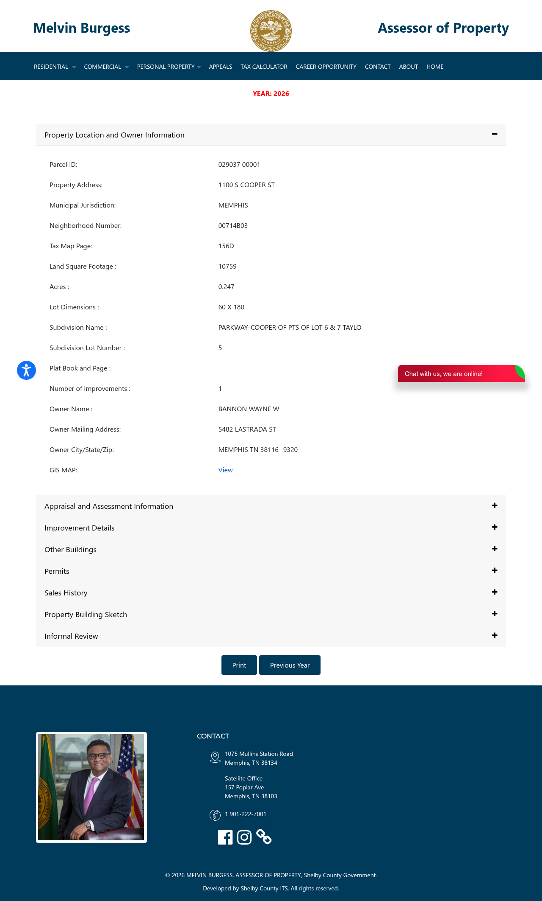

# Wholesale Property Profile

**Address:** 1100 S COOPER ST
**Parcel ID:** `029037  00001`
**Status:** :x: REJECTED

## Public Record (Shelby County Assessor)

| Field | Value |
|---|---|
| Owner | BANNON WAYNE W |
| Land use | - DUPLEX |
| Year built | 1900 |
| Square feet | 1782 |
| Subdivision | _(not extracted)_ |
| Land appraisal | $30,300 |
| Building appraisal | $86,700 |
| **Total appraisal** | **$117,000** |
| Source URL | <https://www.assessormelvinburgess.com/propertyDetails?IR=true&parcelid=029037%20%2000001> |

## Buybox Check (Chris Ulander / Mid South Homebuyers)

Required: year_built >= 1940 | ARV $50k-$200k | SFR or duplex (no vacant /
religious / commercial)

**Decision:** FAIL

Failure reasons (if any):
- year_built 1900 < 1940

## Offer Math (starting point only -- comps required before live)

- ARV proxy (Shelby total appraisal): $117,000
- Estimated repairs (stub default): $25,000
- Assignment fee (Lucrex): $5,000
- **MAO offer to seller:** **$51,500**
- Formula: `ARV * 0.70 - repairs - assignment_fee = MAO`

## Assessor Page Screenshot

## Generated

2026-05-07T18:21:13-0700
