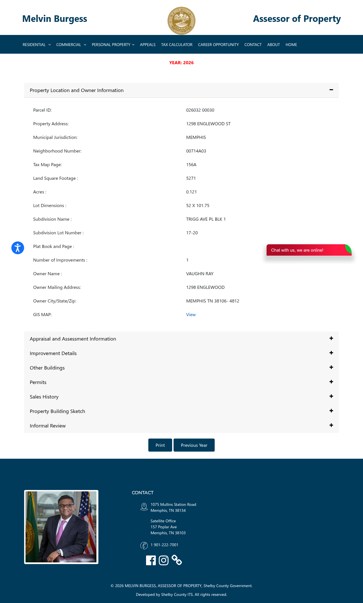

# Wholesale Property Profile

**Address:** 1298  ENGLEWOOD ST
**Parcel ID:** `026032  00030`
**Status:** :x: REJECTED

## Public Record (Shelby County Assessor)

| Field | Value |
|---|---|
| Owner | VAUGHN RAY |
| Land use | - SINGLE FAMILY |
| Year built | 1912 |
| Square feet | 1176 |
| Subdivision | _(not extracted)_ |
| Land appraisal | $4,200 |
| Building appraisal | $34,200 |
| **Total appraisal** | **$38,400** |
| Source URL | <https://www.assessormelvinburgess.com/propertyDetails?IR=true&parcelid=026032%20%2000030> |

## Buybox Check (Chris Ulander / Mid South Homebuyers)

Required: year_built >= 1940 | ARV $50k-$200k | SFR or duplex (no vacant /
religious / commercial)

**Decision:** FAIL

Failure reasons (if any):
- year_built 1912 < 1940
- appraisal 38400 < 50000

## Offer Math (starting point only -- comps required before live)

- ARV proxy (Shelby total appraisal): $38,400
- Estimated repairs (stub default): $25,000
- Assignment fee (Lucrex): $5,000
- **MAO offer to seller:** **$0**
- Formula: `ARV * 0.70 - repairs - assignment_fee = MAO`

## Assessor Page Screenshot

## Generated

2026-05-07T18:19:41-0700
