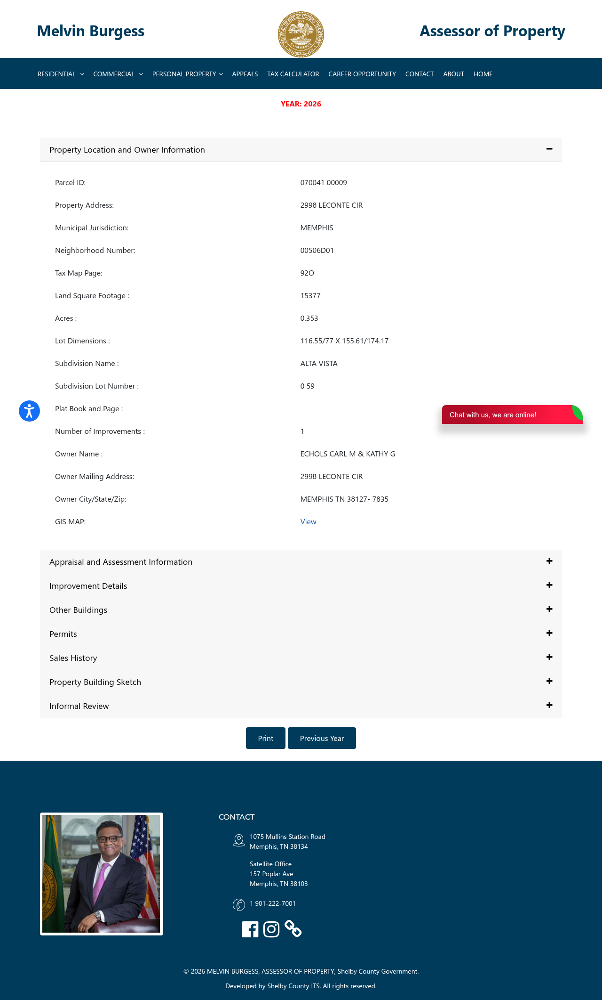

# Wholesale Property Profile

**Address:** 2998  LECONTE CIR
**Parcel ID:** `070041  00009`
**Status:** :white_check_mark: QUALIFIED for Chris

## Public Record (Shelby County Assessor)

| Field | Value |
|---|---|
| Owner | ECHOLS CARL M &amp; KATHY G |
| Land use | - SINGLE FAMILY |
| Year built | 1950 |
| Square feet | 1498 |
| Subdivision | _(not extracted)_ |
| Land appraisal | $7,400 |
| Building appraisal | $74,700 |
| **Total appraisal** | **$82,100** |
| Source URL | <https://www.assessormelvinburgess.com/propertyDetails?IR=true&parcelid=070041%20%2000009> |

## Buybox Check (Chris Ulander / Mid South Homebuyers)

Required: year_built >= 1940 | ARV $50k-$200k | SFR or duplex (no vacant /
religious / commercial)

**Decision:** PASS

Failure reasons (if any):
(none)

## Offer Math (starting point only -- comps required before live)

- ARV proxy (Shelby total appraisal): $82,100
- Estimated repairs (stub default): $25,000
- Assignment fee (Lucrex): $5,000
- **MAO offer to seller:** **$27,000**
- Formula: `ARV * 0.70 - repairs - assignment_fee = MAO`

## Assessor Page Screenshot

## Generated

2026-05-07T19:20:23-0700
