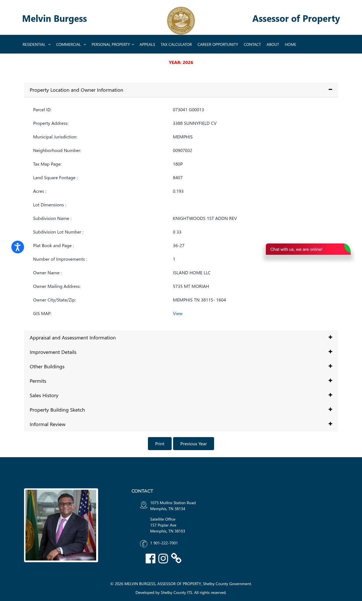

# Wholesale Property Profile

**Address:** 3388  SUNNYFIELD CV
**Parcel ID:** `073041 G00013`
**Status:** :white_check_mark: QUALIFIED for Chris

## Public Record (Shelby County Assessor)

| Field | Value |
|---|---|
| Owner | ISLAND HOME LLC |
| Land use | - DUPLEX |
| Year built | 1970 |
| Square feet | 2048 |
| Subdivision | _(not extracted)_ |
| Land appraisal | $13,500 |
| Building appraisal | $106,800 |
| **Total appraisal** | **$120,300** |
| Source URL | <https://www.assessormelvinburgess.com/propertyDetails?IR=true&parcelid=073041%20G00013> |

## Buybox Check (Chris Ulander / Mid South Homebuyers)

Required: year_built >= 1940 | ARV $50k-$200k | SFR or duplex (no vacant /
religious / commercial)

**Decision:** PASS

Failure reasons (if any):
(none)

## Offer Math (starting point only -- comps required before live)

- ARV proxy (Shelby total appraisal): $120,300
- Estimated repairs (stub default): $25,000
- Assignment fee (Lucrex): $5,000
- **MAO offer to seller:** **$54,000**
- Formula: `ARV * 0.70 - repairs - assignment_fee = MAO`

## Assessor Page Screenshot

## Generated

2026-05-07T19:21:02-0700
